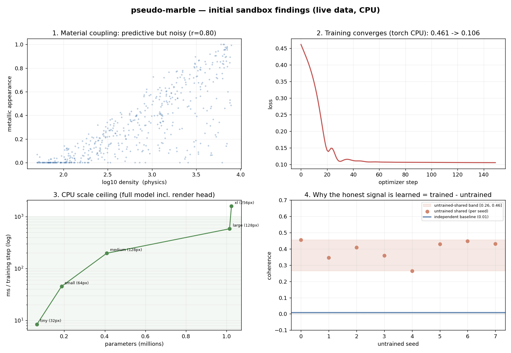
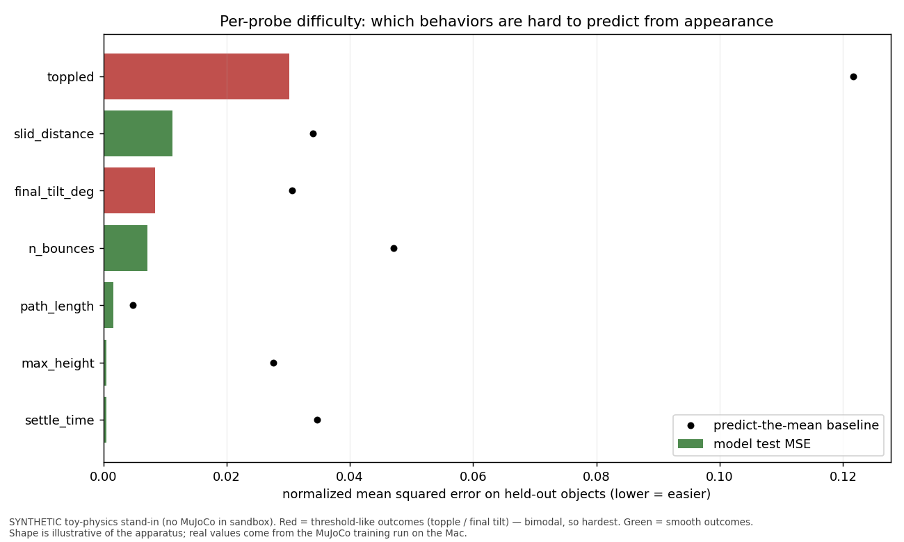

# pseudo-marble — model & initial sandbox findings

Status as of the apparatus being complete (PRs #1–#7 merged). This records the
model and what the **in-sandbox** (Linux CPU, no Mac) tests have and have *not*
established. The headline scientific result is deliberately **not** here yet — it
requires training on real renders on the Mac.

---

## 1. What the model is

A single shared-latent network that, from multi-view images of an object, emits
three projections of one understanding:

```
images (B, N, H, W, 3)
   └─ encoder: per-view CNN → global avg-pool → Linear → mean over N views → z
        z  ──► behavior head : 21-dim drop/tilt/push outcomes   (the real target)
        z  ──► essence  head : (density, friction, restitution) (aux supervision)
        z  ──► render   head : conv decoder → mean-view image    (appearance)

loss = behavior MSE + 0.3·essence MSE + 1.0·render MSE
```

- **Render head** is a lightweight conv decoder (Linear → seed map → [nearest
  upsample ×2 + Conv] × k → sigmoid), *not* a Gaussian-splat decoder — we measure
  coherence, not photorealism. `image_size` must be `render_seed·2^k`.
- **One architecture, three mirrored backends** from one `ModelConfig`:
  `mlx_net` (canonical trainer, Apple Metal), `numpy_net` (forward-only),
  `torch_net` (CPU, trainable in-sandbox).

### The task it learns
- **Continuous materials** (`MaterialSampler`): a hidden 4-factor essence
  (heaviness/grip/hardness/clarity) generates *both* physics and appearance, with
  noise so appearance is **predictive but not invertible** — the model must infer
  the essence, not look it up.
- **Behavior under action** (`probes.py`): drop (bounce/settle), tilt (slide),
  push (slide vs **topple** — shape × material interact). Outcomes are summary
  stats: toppled, settle_time, slid_distance, n_bounces, max_height, path_length,
  final_tilt_deg.
- **Generalization split** (`RegionHoldout`): a region of essence-space is held
  out for test, so the metric is interpolation/extrapolation, not memorization.

### The measurement (`coherence_bench.py`)
Nudge `z`; if the directions that change the *render* also change the *behavior*,
the heads share structure (coherent) vs. live in private subspaces (~0). Compared
against an **independent baseline** (render-only + behavior-only models with
separate latents, joined as a disjoint latent → ~0 by construction).

---

## 2. Initial findings from sandbox tests

All numbers below are from a 4-core / 15 GB Linux CPU container, using the numpy
and torch backends. They establish that the **apparatus works**; they are **not**
the scientific result.



*(Figure regenerable from live data with `python scripts/make_figures.py`.)*

### F1 — No usable Linux MLX; numpy/torch fill the gap
The pip `mlx` wheel on Linux x86 is non-functional (missing `libmlx.so`), and
there's no GPU (so cudamat/Theano/CUDA paths are out). NumPy and CPU PyTorch
install and run, which is why the model has three mirrored backends: MLX stays
the canonical Mac trainer; numpy validates forward shapes anywhere; torch CPU
verifies the training loop converges.

### F2 — The authored coupling is real but noisy (as intended)
Across 500 sampled materials, "looks metallic" vs. log-density correlates inside
the band `0.3 < r < 0.99` — predictive enough to learn, noisy enough that it
can't be a lookup table. (Guarded by a test.)

### F3 — The full model trains (gradients flow end to end)
The torch overfit smoke (encoder + all three heads, incl. the render decoder)
drops loss ~4.8–4.9× in 200 steps on a fixed batch. This proves the architecture
is differentiable and wired correctly — **not** that it learns generalizable
physics.

### F4 — In-sandbox scale ceiling (full model, incl. render head)

| case | img | views | params | ms/step | peak RSS | loss (overfit) |
|---|---|---|---|---|---|---|
| tiny | 32 | 4 | 0.07M | 15.8 | 328 MB | 0.449→0.304 |
| small | 64 | 8 | 0.19M | 49.9 | 379 MB | 0.430→0.198 |
| medium | 128 | 12 | 0.41M | 268 | 668 MB | 0.416→0.180 |
| **large** | **128** | **16** | **1.01M** | **847** | **913 MB** | **0.420→0.114** |
| xl | 256 | 8 | 1.02M | 2357 | 1309 MB | 0.430→0.126 |

Comfortable to **~1M params / 128px / 16 views** (sub-second–~0.85 s/step) for
correctness + convergence checks. Past 256px, CPU step time makes real training
impractical — confirming MLX/Metal on the Mac as the canonical trainer. **Memory
is never the bound** (peak 1.3 of 15 GB); compute time is.

### F5 — The coherence metric had a subtle bug, now fixed
Unit-sphere perturbation directions make two *disjoint* latent subspaces
anti-correlated (a simplex artifact), so an independent baseline would score
*negative* instead of ~0. Fixed to **iid Gaussian directions**; a test locks it.

### F6 — ⭐ The shared-vs-independent gap is mostly architectural, not learned
Running the harness on **untrained** numpy models:

```
shared_coherence        0.4565
independent_coherence    0.0076   ← "glued together" control, ~0 as expected
architectural_coherence  0.3591   ← a second untrained shared init
```

An **untrained** shared model already scores ~0.45 coherence — purely because
both heads read the same `z`. So a naive "shared beats independent" result would
be an **architectural artifact, not evidence of a learned eigenvector**. Had we
run that comparison on the Mac and seen a big gap, we'd have falsely "confirmed"
the hypothesis.

The honest signal is therefore:

> **`learned_coherence = trained_shared − untrained_shared`**, averaged over
> several untrained seeds (the baseline itself varies ~0.36–0.46), evaluated on
> **held-out essence regions**, and paired with **behavior generalization**.

This control is baked into `compare()`. The apparatus caught this *before* any
Mac time was spent — arguably the most valuable sandbox finding. Its logic
(subtract the architectural prior, keep the residual) is the same move predictive
coding makes for a prediction error — see
[`PREDICTIVE_CODING.md`](PREDICTIVE_CODING.md).

---

### F7 — Per-probe difficulty (methodology illustration)

Which behavior outputs are hard to predict from appearance? Real per-field
difficulty needs the MuJoCo run, but training the *actual* torch model on a
synthetic toy-physics stand-in shows the apparatus and the expected ordering:



Smooth outcomes (settle time, max height) are easiest; **toppling is hardest** —
it is a bimodal threshold (tips or it doesn't), so a regression head cannot land
cleanly near the tipping point (the "chaos near tipping points" risk from
`BEHAVIOR_TASK.md`, made visible). The model beats a predict-the-mean baseline on
every field. The *numbers* are from a synthetic stand-in
(`scripts/figure_probe_difficulty.py`); the real ordering comes from the Mac run.

## 3. What is NOT yet known (honest gaps)

- **No training on real renders.** Every "training" result above overfits random
  or synthetic data; it shows gradients flow, nothing about generalization.
- **The coupling is authored.** MuJoCo/Blender decouple appearance and physics, so
  we are (at best) learning the *generator's* eigenvector, not reality's. The GSO
  experiment (`docs/GSO_EXPERIMENT.md`) is the parked route to real measured data.
- **The headline result is unmeasured.** `learned_coherence` on held-out essence
  regions — the number that answers "one understanding or two?" — has not been
  produced.
- **Behavior-label stability at scale** (the "chaos near tipping points" risk in
  `docs/BEHAVIOR_TASK.md`) hasn't been observed on real sims yet.

---

## 4. The one remaining step — the result (on the Mac)

```bash
pip install -e ".[mlx]"
python -m pseudomarble.data.generate_mujoco --output data/pm --resolution 128 --num-scenes 256
python -m pseudomarble.models.train --data data/pm --epochs 30 --image-size 128 --out runs/shared
# + train render-only and behavior-only models, then:
#   coherence_bench.compare(shared, render_only, behavior_only, images,
#                           untrained_shared_model=fresh_init)
```

Read `learned_coherence` against the 0.36–0.46 architectural band on the held-out
region, alongside behavior MSE. If it clears the band → evidence the latent
learned to couple appearance and physics. If it sits at ~0 → a real null: "two
outputs in one wrapper." Either way, report it straight.

---

*Tests: 81 across 15 suites, all passing; core imports with no
mujoco/bpy/trimesh/numpy/mlx/torch. Personal research; not affiliated with World
Labs.*
