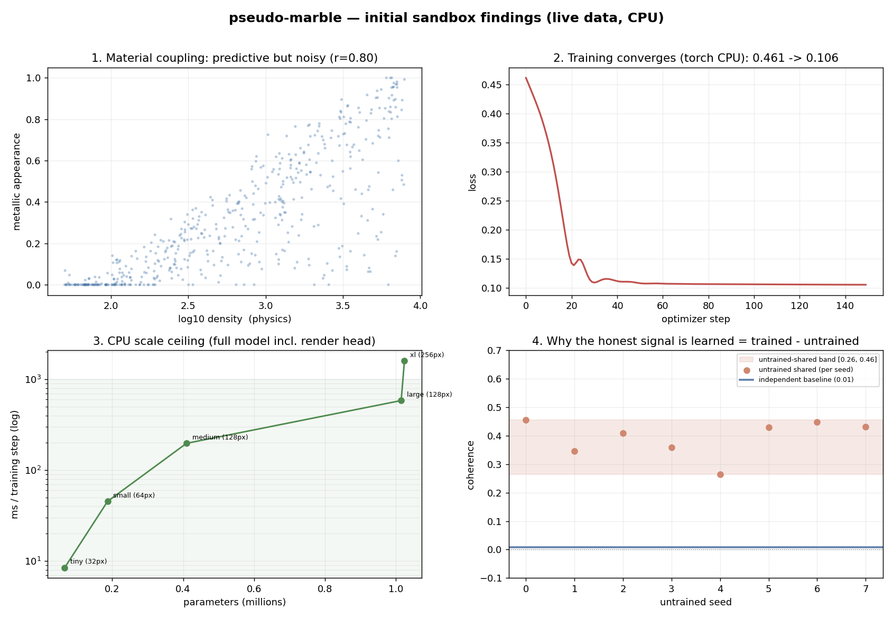
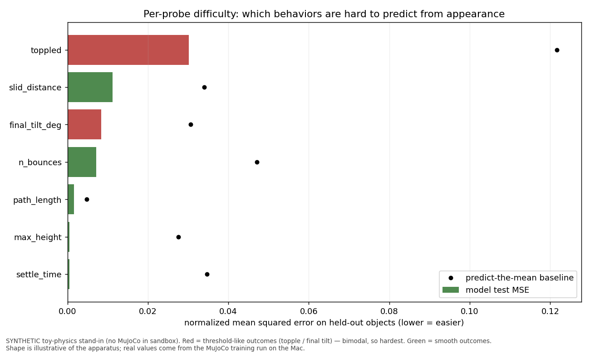

# pseudo-marble — model & initial sandbox findings

Status: the apparatus is complete **and the headline experiment has been run on the
Mac.** F1–F7 record the model and what the **in-sandbox** (Linux CPU, no Mac) tests
established; **F8** is the first real-MuJoCo result (probe-label stability); **F9**
is the 5-seed coherence measurement (a weak, seed-unstable positive); **F10** is the
20-seed resolution — the mean gain is significant, the "instability" is two training
basins (escaped vs encoder-collapsed), and raw coherence is inflated by the collapsed
basin. **Quote F10, not F9.** **F11** turns the instrument outward: an external LLM
world model (Qwen-AgentWorld) scored against our MuJoCo ground truth — reasoning
format transfers, contact physics doesn't, topple calibration beats our own model.
**F12** closes F10's mystery: encoder collapse is an early-LR overshoot pathology —
at lr 5e-4 all 20 seeds train healthy (20/20 vs 13/20), so the "two basins" were an
avoidable artifact. **F13** is the payoff: unconditional learned coherence **+0.146
(t≈8.3) / +0.123 (t≈5.5)**, both targets clearing the band with no conditioning —
the project's headline number (quote F13). **F14** took the instrument to reality
(ABO, real products, real listed masses) and returned VOID by its own preregistered
gates: with contact parameters assumed constant, the probe battery is nearly
mass-blind, so prediction fails on held-out categories and coherence is
uninterpretable there — the reality test remains open, honestly. **F15** closes the
soft-topple loose end (cleaner labels help the topple field 3.3→5.5×, not the
coupling). **F16** falsifies the cheap F14 repair (within-category holdout: gain
0.975) — the probes, not the split, are binding. **F17** measures the essence's
size with an FSQ bottleneck: behavior saturates at ONE trit (~1.6 bits) while
render starves at fifty, and a 1-trit code nearly doubles learned coherence with
prediction intact. **F18 corrects F17's closing claim** and is the one to quote
on "what is the essence?": an oracle on the generator's own inputs shows the
trained model's held-out gain is **statistically indistinguishable from a
shape-only oracle** (1.41 vs 1.33, CI [1.01, 1.79]) while shape+appearance
reaches 2.31 — the model extracts **~8% of the essence signal reachable from
pixels**. The 1.6 bits was the *shape bucket*, not the world's richness, and the
**model — not the benchmark — is the binding constraint.** **F19** locates that
constraint with a `z → appearance_params` probe: the visible appearance IS in
the latent (color retention 84–89%) but the behavior head converts none of it to
held-out gain (loss/architecture, cheap to fix), while friction and restitution
were authored nearly out of the pixels entirely (render-bound, expensive) — "the
head is binding for what's visible; the renderer for the contact physics."
**F20** tests and corrects F19: an appearance-reconstruction auxiliary *does*
force the essence-bearing channels (roughness/metallic/transmission) back into
`z`, but behavior gain moves only 1.37 → 1.46 (ceiling 1.57), not toward 2.26 —
the channels sit in `z` too noisily at 128px to use. The 1.33→2.26 gap is
~+0.1 head + ~+0.1 encoder-retention + **~+0.7 render-fidelity-bound**; the
last dominates. F19's "loss/architecture, cheap fix" is retracted.
**F21** then *refutes* F20's own "render-bound" conclusion: Arm 1 made the essence
more available (noise→0 widens the oracle−model gap 0.80→1.01) and Arm 2 made it
more legible (oblique 256px doubles roughness reachability 0.16→0.37), and
**neither moved behavior gain off ~1.5.** Render fidelity is not the barrier —
the essence→behavior coupling is intrinsically too subtle to learn to the oracle
ceiling from pixels, at any fidelity. That is the terminus: the coupling is real
(F13) but small, shape not essence (F18), and no fidelity lever recovers it.

---

## 1. What the model is

A single shared-latent network that, from multi-view images of an object, emits
three projections of one understanding:

```
images (B, N, H, W, 3)
   └─ encoder: per-view CNN → global avg-pool → Linear → mean over N views → z
        z  ──► behavior head : 21-dim drop/tilt/push outcomes   (the real target)
        z  ──► essence  head : (density, friction, restitution) (aux supervision)
        z  ──► render   head : conv decoder → mean-view image    (appearance)

loss = behavior MSE + 0.3·essence MSE + 1.0·render MSE
```

- **Render head** is a lightweight conv decoder (Linear → seed map → [nearest
  upsample ×2 + Conv] × k → sigmoid), *not* a Gaussian-splat decoder — we measure
  coherence, not photorealism. `image_size` must be `render_seed·2^k`.
- **One architecture, three mirrored backends** from one `ModelConfig`:
  `mlx_net` (canonical trainer, Apple Metal), `numpy_net` (forward-only),
  `torch_net` (CPU, trainable in-sandbox).

### The task it learns
- **Continuous materials** (`MaterialSampler`): a hidden 4-factor essence
  (heaviness/grip/hardness/clarity) generates *both* physics and appearance, with
  noise so appearance is **predictive but not invertible** — the model must infer
  the essence, not look it up.
- **Behavior under action** (`probes.py`): drop (bounce/settle), tilt (slide),
  push (slide vs **topple** — shape × material interact). Outcomes are summary
  stats: toppled, settle_time, slid_distance, n_bounces, max_height, path_length,
  final_tilt_deg.
- **Generalization split** (`RegionHoldout`): a region of essence-space is held
  out for test, so the metric is interpolation/extrapolation, not memorization.

### The measurement (`coherence_bench.py`)
Nudge `z`; if the directions that change the *render* also change the *behavior*,
the heads share structure (coherent) vs. live in private subspaces (~0). Compared
against an **independent baseline** (render-only + behavior-only models with
separate latents, joined as a disjoint latent → ~0 by construction).

---

## 2. Initial findings from sandbox tests

All numbers below are from a 4-core / 15 GB Linux CPU container, using the numpy
and torch backends. They establish that the **apparatus works**; they are **not**
the scientific result.



*(Figure regenerable from live data with `python scripts/make_figures.py`.)*

### F1 — No usable Linux MLX; numpy/torch fill the gap
The pip `mlx` wheel on Linux x86 is non-functional (missing `libmlx.so`), and
there's no GPU (so cudamat/Theano/CUDA paths are out). NumPy and CPU PyTorch
install and run, which is why the model has three mirrored backends: MLX stays
the canonical Mac trainer; numpy validates forward shapes anywhere; torch CPU
verifies the training loop converges.

### F2 — The authored coupling is real but noisy (as intended)
Across 500 sampled materials, "looks metallic" vs. log-density correlates inside
the band `0.3 < r < 0.99` — predictive enough to learn, noisy enough that it
can't be a lookup table. (Guarded by a test.)

### F3 — The full model trains (gradients flow end to end)
The torch overfit smoke (encoder + all three heads, incl. the render decoder)
drops loss ~4.8–4.9× in 200 steps on a fixed batch. This proves the architecture
is differentiable and wired correctly — **not** that it learns generalizable
physics.

### F4 — In-sandbox scale ceiling (full model, incl. render head)

| case | img | views | params | ms/step | peak RSS | loss (overfit) |
|---|---|---|---|---|---|---|
| tiny | 32 | 4 | 0.07M | 15.8 | 328 MB | 0.449→0.304 |
| small | 64 | 8 | 0.19M | 49.9 | 379 MB | 0.430→0.198 |
| medium | 128 | 12 | 0.41M | 268 | 668 MB | 0.416→0.180 |
| **large** | **128** | **16** | **1.01M** | **847** | **913 MB** | **0.420→0.114** |
| xl | 256 | 8 | 1.02M | 2357 | 1309 MB | 0.430→0.126 |

Comfortable to **~1M params / 128px / 16 views** (sub-second–~0.85 s/step) for
correctness + convergence checks. Past 256px, CPU step time makes real training
impractical — confirming MLX/Metal on the Mac as the canonical trainer. **Memory
is never the bound** (peak 1.3 of 15 GB); compute time is.

### F5 — The coherence metric had a subtle bug, now fixed
Unit-sphere perturbation directions make two *disjoint* latent subspaces
anti-correlated (a simplex artifact), so an independent baseline would score
*negative* instead of ~0. Fixed to **iid Gaussian directions**; a test locks it.

### F6 — ⭐ The shared-vs-independent gap is mostly architectural, not learned
Running the harness on **untrained** numpy models:

```
shared_coherence        0.4565
independent_coherence    0.0076   ← "glued together" control, ~0 as expected
architectural_coherence  0.3591   ← a second untrained shared init
```

An **untrained** shared model already scores ~0.45 coherence — purely because
both heads read the same `z`. So a naive "shared beats independent" result would
be an **architectural artifact, not evidence of a learned eigenvector**. Had we
run that comparison on the Mac and seen a big gap, we'd have falsely "confirmed"
the hypothesis.

The honest signal is therefore:

> **`learned_coherence = trained_shared − untrained_shared`**, averaged over
> several untrained seeds (the baseline itself varies ~0.36–0.46), evaluated on
> **held-out essence regions**, and paired with **behavior generalization**.

This control is baked into `compare()`. The apparatus caught this *before* any
Mac time was spent — arguably the most valuable sandbox finding. Its logic
(subtract the architectural prior, keep the residual) is the same move predictive
coding makes for a prediction error — see
[`PREDICTIVE_CODING.md`](PREDICTIVE_CODING.md).

---

### F7 — Per-probe difficulty (methodology illustration)

Which behavior outputs are hard to predict from appearance? Real per-field
difficulty needs the MuJoCo run, but training the *actual* torch model on a
synthetic toy-physics stand-in shows the apparatus and the expected ordering:



Smooth outcomes (settle time, max height) are easiest; **toppling is hardest** —
it is a bimodal threshold (tips or it doesn't), so a regression head cannot land
cleanly near the tipping point (the "chaos near tipping points" risk from
`BEHAVIOR_TASK.md`, made visible). The model beats a predict-the-mean baseline on
every field. The *numbers* are from a synthetic stand-in
(`scripts/figure_probe_difficulty.py`); the real ordering comes from the Mac run.

---

### F8 — ⭐ First real-MuJoCo result: the topple label is locally chaotic but the contamination is bounded — and degenerate for half the shapes

This is the **first empirical result from real MuJoCo on the Mac** (not a synthetic
stand-in), produced by `tests/batch_probe_stability.py` (pure-sim, no rendering,
~5 s). It de-risks the behavior labels before training, directly testing the
"chaos near tipping points" risk in `docs/BEHAVIOR_TASK.md`. The PUSH probe records
`toppled = final_tilt_deg > 50°` — a hard threshold.

**The sim is deterministic.** Same `(shape, material)` run 3× ⇒ max field diff
`0`. So the docs' "average over seeds" mitigation cannot work by re-running a
scene; it requires injecting initial-condition / action jitter.

**Chaos is real, sharp, and localised to the crossover** (sweeping heaviness→density
at grip=0.5, hardness=0.3). The cylinder — the docs' canonical "tall topples where
squat slides" case — flips from upright to over across a near-step transition
(slope ≈ 2160°/heaviness-unit at crossover h≈0.23). Under a **3% push-impulse
jitter** (24 reps), the binary label's flip-rate is:

| location (cylinder) | p_topple | flip-rate | final_tilt |
|---|---|---|---|
| far_light (h=0.00) | 1.00 | 0.00 | 90.0 ± 0.0° |
| **near boundary (h=0.23)** | **0.33** | **0.33** | **31.5 ± 41.3°** |
| far_heavy (h=0.53) | 0.00 | 0.00 | 0.0 ± 0.0° |

A tiny action difference flips the label ~⅓ of the time **only** at the crossover;
30% away on either side it is rock-stable (σ=0°). Chaos is a thin shell, not a fog.

**But `toppled` is degenerate for half the shape set** (multi-seed population,
5 seeds × 200 scenes, the generator's own sampler):

| shape | topple_rate (mean ± std) | label class |
|---|---|---|
| box | 0.000 ± 0.000 | **never** (always slides) |
| capsule | 1.000 ± 0.000 | **always** (rolls onto its side) |
| sphere | 0.447 ± 0.101 | **ill-posed** (no upright pose; tilt just measures rolling) |
| cylinder | 0.244 ± 0.047 | genuine boundary |
| ellipsoid | 0.062 ± 0.033 | genuine boundary |

So the topple bit carries **zero learnable signal for box/capsule** (a constant)
and is **meaningless for the sphere** (rotational symmetry → arbitrary final
orientation). It is a genuine, non-degenerate target only for the cylinder and
ellipsoid — and that is exactly where it is chaotic.

**The contamination is bounded** (fraction of all scenes within a deadband of the
50° threshold, multi-seed): `±5°: 0.017 ± 0.015`, `±10°: 0.030 ± 0.018`,
`±15°: 0.043 ± 0.021`. Only ~2–4% of sampled scenes sit in the ambiguous band;
overall topple_rate `0.357 ± 0.033`.

**Implications for the experiment** (to decide before the coherence run, not yet
applied):
- Prefer the **continuous `final_tilt_deg`** over the binary `toppled` (no
  threshold discontinuity), or replace `toppled` with a **jitter-averaged soft
  topple probability** — a well-defined, smooth target.
- `toppled`'s degeneracy means a behavior head can score "well" on it for free
  (box/capsule) or be supervised by noise (sphere). When reading per-field
  behavior MSE and `learned_coherence`, treat `push.toppled` separately — consider
  reporting coherence with and without it, and excluding the sphere from
  topple-based analysis.
- The smooth fields (settle_time, max_height, slid_distance, …) are unaffected.

Reproduce: `python tests/batch_probe_stability.py` (writes
`runs/stability/probe_stability.json` with the raw sweep arrays for plotting).

---

### F9 — ⭐ Coherence experiment: a weak, seed-UNSTABLE positive — the multi-seed run CORRECTS the single-seed pilot

This is the project's headline measurement, run properly. **The honest verdict:
training raises render↔physics coherence modestly above both baselines *on
average*, but the effect is small and swings wildly with the training seed — it is
NOT (yet) evidence of a reliable shared eigenvector.** A single-seed pilot badly
overstated it; this entry is the correction.

Setup: dataset `pm_big` — 512 scenes, 8 views, 128px, **extrapolation** holdout
(heavy+bouncy corner), 492 train / **20 test**. **5 shared seeds** (50 epochs each)
+ a **render-only** and a **physics-only** model (per-head loss weights) for the
independent control. Coherence on the held-out region (48 dirs); architectural
baseline over 5 fresh untrained inits. `scripts/run_coherence_experiment.py`.

| target | trained (5 seeds) | architectural (5 seeds) | independent (disjoint-latent) | learned = trained − arch |
|---|---|---|---|---|
| behavior | 0.276 **± 0.166** | 0.109 ± 0.029 | 0.030 | +0.168 (within seed noise) |
| essence  | 0.261 **± 0.157** | 0.096 ± 0.021 | 0.046 | +0.165 (within seed noise) |

**What holds:** the ordering **independent (~0.04) < architectural (~0.10) <
trained (~0.27 avg)** is real — the disjoint-latent ~0 control works, and trained
models sit above both baselines on average.

**What breaks the strong claim:** trained coherence is **enormously seed-unstable**
— essence ranges **0.10 → 0.49**, behavior **0.17 → 0.60** across the 5 seeds. The
trained std (~0.16) is as large as the gain. Crucially the architectural baseline's
std on the *same* 20 scenes and directions is only ~0.03, so the spread is **genuine
training-seed variance, not measurement noise**: some inits learn the coupling, some
don't. By mean ± std the learned gain is *within* the cross-seed band (t≈2.2, n=5 —
marginal, not significant).

**The correction.** The earlier provisional pilot (`pm_mid`, single seed 0) reported
essence learned **+0.369 at ~7.7σ**. That was a lucky draw: on `pm_big` the **seed-0**
model gives essence coherence **0.110** — right at the untrained baseline. Multi-seed
collapses the headline to +0.165 and reclassifies it as marginal. The pilot's other
"tell" was also atypical: its participation ratio was 61.7 (vs untrained 7.6); across
the 5 `pm_big` seeds it is **10.8 vs 8.3** — the trained models barely spread the
representation here.

**A precise sub-finding:** prediction quality is **stable** across seeds (held-out
behavior MSE 0.032–0.051, all modestly beating predict-mean) while representational
**coupling is not**. The heads *predict* consistently; whether they *share structure*
depends on initialization. Coupling of direction (when it appears) without reliable
accuracy on the extrapolation corner.

**Open:** more seeds (10–20) to settle significance; longer training / larger
held-out set; investigate the init-sensitivity (loss-landscape basins, or the F8
behavior-label noise). Reproduce: train the 7 models (`runs/big/*`), then
`python scripts/run_coherence_experiment.py --data data/pm_big --checkpoints
runs/big/shared_s0/model.safetensors,…,shared_s4/… --render-only
runs/big/render_only/model.safetensors --physics-only
runs/big/physics_only/model.safetensors` (writes `runs/big_coherence/coherence_report.json`).

**→ Settled by F10:** the 20-seed sweep resolved the significance question and
explained the instability — read F10 before quoting any F9 number.

---

### F10 — ⭐ 20-seed sweep: the mean gain is real — but "seed instability" is two basins, and the coherence metric prefers the DEGENERATE one

Setup: same data + protocol as F9 (`pm_big`, extrapolation holdout, 50 epochs,
48 dirs), extended to **20 shared seeds** (F9's s0–s4 reused, s5–s19 new), the
architectural baseline widened to **10 fresh untrained inits**, same independent
(disjoint-latent) controls. `scripts/run_coherence_experiment.py` →
`runs/big_coherence_20seed/coherence_report.json`.

| target | trained (20 seeds) | architectural (10 inits) | independent | learned = trained − arch | t (diff of means) |
|---|---|---|---|---|---|
| behavior | 0.346 ± 0.184 | 0.125 ± 0.031 | 0.030 | **+0.221** | **5.2** |
| essence  | 0.237 ± 0.150 | 0.072 ± 0.040 | 0.046 | **+0.165** | **4.6** |

**At the mean level, F9's "marginal" is corrected to "significant":** with n=20
the learned gain is well-resolved for both targets, and the F6 ordering
independent < architectural < trained is intact.

**But the per-seed spread is not noise — it is bimodal.** Held-out behavior MSE
splits the 20 seeds into two exact populations:

| basin | seeds | held-out gain over predict-mean | latent participation ratio (PR) | coherence (behavior) |
|---|---|---|---|---|
| **escaped** | 13/20 | 1.36–1.64× | 8–84 | 0.279 ± 0.167 |
| **collapsed** | 7/20 (s2,5,6,11,12,15,19) | 1.00–1.01× (exactly predict-mean) | **0.0 — all of them** | **0.469 ± 0.173** |

The collapsed basin is an **encoder collapse**: PR ≈ 0 means `z` is (numerically)
the *same vector for every scene* — the encoder ignores its input (untrained
encoders score PR ≈ 8, so training actively destroys input-dependence in this
basin). Train loss never leaves the 0.0746 plateau; the behavior head can only
predict the mean. The separation is binary — every stuck seed has PR 0.0, every
escaped seed PR ≥ 8 — so PR is a clean post-hoc basin classifier.

**The falsification test (run, negative, informative).** Escaped seeds leave the
plateau at epochs 3–48, which *looked* like a stochastic waiting time — implying
"train longer and everyone escapes." Training is deterministic per seed (init
seeded by `--seed`, shuffles seeded per-epoch), so we retrained all 7 collapsed
seeds to **150 epochs** (first 50 reproduce exactly): **0/7 escaped** (loss
0.0746 → 0.0742, flat). The basin is **selected at initialization**; longer
training does not rescue it. And at 150 epochs the collapsed models' pooled
"learned coherence" rises to **+0.288 — it "clears the band"** — while two of
them score held-out behavior MSE *worse* than predict-mean (0.0537–0.0539 vs
0.0516 baseline).

**Methodological caution (the load-bearing lesson).** Across the 20 seeds,
coherence *positively* correlates with held-out error — corr(behavior coherence,
behavior MSE) = **+0.54**. Mechanism: a constant-`z` encoder gives every scene
the same latent operating point, and whatever local render↔behavior alignment
exists at that one point is credited for the whole test set. **Raw coherence is
therefore inflated by degeneracy and must never be reported alone — pair it with
(a) held-out prediction gain-over-mean and (b) latent participation ratio. A
high-coherence model with gain ≈ 1 or PR ≈ 0 is collapsed, not coupled.**

**The honest headline, conditional on non-collapse:** among the 13 escaped seeds,
learned coherence = **+0.154 behavior (t≈3.3)** and **+0.155 essence (t≈4.2)** —
real, modest, and now statistically resolved. This replaces both F9's +0.168
"within noise" and the raw 20-seed +0.221 (which is partly collapse-inflated) as
the number to quote.

**Open:** what property of an init selects the basin (13:7 escape:collapse at
these hyperparameters); whether a behavior-weight warmup or LR schedule changes
the collapse rate; the soft-topple clean-label re-run (unchanged from F8/F9).

Reproduce: train seeds 5–19 (as F9, `--seed N --out runs/big/shared_sN`), then

```bash
python scripts/run_coherence_experiment.py --data data/pm_big \
    --checkpoints runs/big/shared_s0/model.safetensors,…,shared_s19/model.safetensors \
    --render-only runs/big/render_only/model.safetensors \
    --physics-only runs/big/physics_only/model.safetensors \
    --untrained-seeds 10 --out runs/big_coherence_20seed
# escape test: retrain s2,5,6,11,12,15,19 with --epochs 150 --out runs/big/shared_sN_e150,
# then the same runner over those checkpoints -> runs/big_coherence_e150
```

---

### F11 — ⭐ LLM world-model transfer test: the reasoning *format* transfers, the contact physics doesn't — and its topple call is better-calibrated than our own trained model's

An external "language world model" — **Qwen-AgentWorld-35B-A3B** (Alibaba,
arXiv:2606.24597; community Q8 MLX quant, text-only — Qwen shipped no vision
tensors) — was scored against this project's exact MuJoCo ground truth with
`scripts/eval_llm_transfer.py`, served locally (oMLX, M5 Pro). Design point:
AgentWorld's CPT→SFT→RL tuning covers seven **digital** domains (MCP, Search,
Terminal, SWE, Android, Web, OS); rigid-body physics is **out-of-domain** for
that tuning, so this measures whether next-state-prediction *skill* transfers
to a physical substrate — its physics content can only come from base-model
pretraining.

Setup: all 20 held-out `pm_big` scenes (the heavy+bouncy **extrapolation
corner**) × 3 probes × 2 information conditions; temperature 0; scored with
the behavior-head normalizers against the predict-train-mean baseline. The
model reasons long (typically ~17k-token chains, ~4.5 min/request at ~64
tok/s; 4k and 16k budgets truncate mid-derivation — 32k needed). **Zero parse
failures in 120/120 responses.**

| condition | normalized MSE | baseline | gain | push.toppled Brier | fields beating baseline |
|---|---|---|---|---|---|
| essence (true density/friction/restitution given) | 1.277 | 0.052 | 0.04× | **0.100** | **8/21** |
| appearance (rendering params only) | 0.789 | 0.052 | 0.07× | 0.150 | 4/21 |

**Aggregate: ~15–25× worse than predict-the-mean** — but the aggregate is
outlier-dominated and the decomposition is the finding:

1. **The failures are one coherent mistake, not noise.** Nearly all of the MSE
   is ramp-contact: `tilt.slid_distance` 18.70 vs baseline 0.013 (~1400×),
   tilt path_length/n_bounces. The model *derives*, at length, objects
   bouncing and rolling down the 20° incline; MuJoCo's high-friction objects
   grip and stay put. Its bounce counts are ideal restitution-series counts,
   where the simulator's velocity-threshold counter reports few — partly a
   measurement-convention mismatch, partly a different contact world.
2. **The wins are real and structured (essence, 8/21 fields):** `max_height`
   on all three probes (2–4× better than baseline), drop settle_time and
   path_length, push final_tilt_deg — ballistics and geometry. And
   **push.toppled Brier 0.100 vs 0.199 base-rate**: a *calibrated* topple
   judgment on exactly the label F8 showed is chaotic and our regression head
   handles worst.
3. **The essence→appearance ablation shows it actually uses the numbers.**
   Hiding the physics parameters shrinks the contact blow-ups (tilt MSE 3.54
   → 2.08 — it hedges toward typical materials) but collapses the ballistic
   wins (8 → 4 fields; drop settle/path/max_height and push final_tilt all
   lost). Quantitative inputs measurably flow through its derivations.
4. **Against our trained model:** the escaped-basin trained networks score
   held-out behavior MSE 0.033–0.051 (gain 1.36–1.64×) on the same scenes —
   ~15–40× better than the LLM in aggregate. 492 in-world scenes beat a 35B
   out-of-world prior. But the LLM holds two things the small model lacks:
   calibrated topple probability, and per-field wins with **zero** training
   scenes.

**Honest verdict:** "world modeling" transfers as *form* — hold a state, apply
an action, derive the next state, with usable uncertainty on discrete events —
while the *content* (MuJoCo's contact regime) does not. A language world model
is a prior over worlds, and it reasons confidently in a nearby-but-different
one.

Caveats: one model, one community quant, one prompt format; normalized MSE is
outlier-dominated (hence per-field reporting); some "errors" are convention
mismatches with our summarizers (n_bounces counter, 50° threshold).

**Vision-condition addendum (run 2026-07-04 evening).** The third condition —
the model is *shown* 3 rendered views (base64 image parts) instead of told the
appearance parameters — ran on the `havok2` VL36 graft (Qwen3.6 vision tower
weight-grafted onto the AgentWorld backbone; locally converted to mixed 4/6-bit
MLX, 21 GB, 5.01 bpw; **vision sanity gate passed first**: correct shape+color
on synthetic images and a correct description of a pm_big render). Result,
60/60 responses, zero parse failures:

| condition | mse | gain | push.toppled Brier | fields beating baseline |
|---|---|---|---|---|
| appearance (text) | 0.789 | 0.065× | 0.150 | 4/21 |
| **vision (pixels)** | **0.798** | **0.065×** | **0.150** | **4/21** |

Vision ≈ appearance-text almost exactly (per-field: 5 clearly better, 6 clearly
worse, 10 tied). This is the *theoretically correct* outcome, not a null: our
renders are generated FROM the appearance parameters, so pixels carry ~the same
material information as the four numbers by construction — a lossless vision
tower should reproduce the appearance condition, and it did. Two conclusions:
(a) **the graft confound is resolved** — the surgically-attached vision tower
preserved the task-relevant material information (it is not the bottleneck);
(b) the picture→physics inverse in this world measures as: pixels ≈
described-appearance ≪ known-essence, for the ballistic fields. Also
practical: with images in context the model reasons far more tersely (~2
min/request vs ~4.5 text-only). Artifacts: `runs/llm_transfer_vision/`.

Reproduce: serve the model (oMLX, OpenAI-compatible), then per condition::

    python scripts/eval_llm_transfer.py --data data/pm_big --split test \
        --base-url http://127.0.0.1:8000/v1 --model <served-name> \
        --max-tokens 32768 --condition essence --out runs/llm_transfer_essence
    # and --condition appearance -> runs/llm_transfer_appearance
    # responses cached per (scene, probe); reports: transfer_report.json

### F12 — ⭐ Basin selection solved: collapse is an early-LR overshoot pathology; at lr 5e-4 all 20 seeds train healthy

F10 left one mystery: why do 7/20 inits fall into the encoder-collapse basin,
immune to patience (0/7 escaped at 150 epochs)? Two new instruments answered
it: **per-epoch latent-PR logging** in `train.py` (collapse as a visible
trajectory, not a post-hoc test) and a `--behavior-warmup-epochs` lever.
All runs: `pm_big`, 50 epochs, same seeds as F10 (deterministic).

**Discovery 1 — collapse is the universal early state, not a selected basin.**
Every traced seed, healthy or stuck, sits at PR ≈ 0 within the first epochs
(healthy s0 even differentiates to PR 29 after epoch 0, is crushed to 0.1 by
epoch 1, and climbs out at epoch 20). F10's "two basins" are really a
**bimodal escape-time distribution** out of one collapsed attractor — fast
escapers (epochs ~3–25) and a right tail censored at 150.

**Discovery 2 — behavior gradients are the escape force, not the collapse
force.** The warmup hypothesis (defer behavior loss → protect the latent) ran
on 3 healthy controls and failed with the opposite sign: warmup *delayed*
s1's escape (≈4 → ≈15) and s14's (≈5 → ≈45), and **collapsed s3 outright**
(a top-tier healthy seed, PR 0.0 for all 50 epochs). Render+essence gradients
alone never lift PR off zero.

**The registered predictions were wrong — and the data decided.** Predicted
before the stuck-seed runs: warmup rescues 0/7 (actual **3/7**), doubled LR
rescues "some" (actual **1/7**), halved LR rescues 0 (actual **7/7**):

| lever (7 stuck seeds) | escaped | note |
|---|---|---|
| behavior warmup 10 ep | 3/7 | late escapes (ep 15–23) |
| lr 2e-3 (doubled) | 1/7 | |
| **lr 5e-4 (halved)** | **7/7** | **none ever collapse** (PR floor 6.7); gains 1.36–1.64× |

**Confirmation on the 13 originally-healthy seeds at lr 5e-4: 13/13 healthy**
(12 never dip; s14 visits collapse for epochs 0–17 and exits, ending PR 36.8,
gain 1.32×). Combined: **20/20 seeds healthy at lr 5e-4** vs 13/20 at the
default 1e-3, with final gains (mean 1.40×, range 1.32–1.64) indistinguishable
from F10's escaped basin.

**Mechanism (post-hoc, trajectory-supported):** at lr 1e-3 the first-epoch
AdamW steps destroy the encoder's input-dependence faster than any gradient
rebuilds it (s0: PR 29 → 0.1 in one epoch); whether a seed later escapes is a
near-critical race the init decides. At 5e-4 the early differentiation
survives, so there is nothing to escape from. Warmup's 3/7 and doubled-LR's
1/7 read as perturbations of that near-critical dynamic — the LR-halving
result is the categorical axis.

**Implications:**
- Every F10 statistic conditioned on "escaped seeds only" describes an
  **avoidable training artifact**. The unconditional learned-coherence
  question re-opens: re-run the 20-seed coherence experiment at lr 5e-4
  (all-seed statistics, no conditioning) — the agreed next step.
- Keep per-epoch PR in every training log; PR ≈ 0 past ~epoch 25 at these
  hyperparameters means the run is (very likely) wasted.
- `train.py --lr` default is left at 1e-3 until the coherence re-run
  validates 5e-4 end-to-end; change it then, not silently now.

Caveats: one dataset, one architecture, 50-epoch horizon, n=7+13 — but the
effect is binary, sign-consistent across all 20 seeds, and both registered
hypotheses failing is evidence this was measured, not narrated.

Reproduce: `python -m pseudomarble.models.train --data data/pm_big --epochs 50
--seed N --lr 5e-4 --out runs/basin/lrlo_sN` (stuck seeds N ∈ {2,5,6,11,12,
15,19}; warmup lever: `--behavior-warmup-epochs 10`); artifacts under
`runs/basin/` (gitignored, regenerable).

---

### F13 — ⭐ The unconditional number: learned coherence +0.146 (t≈8.3), no asterisks

*Timeline: measured 2026-07-10 (coherence re-run over the F12 checkpoints,
~5 min — no training needed); written up 2026-07-11 alongside F14; merged to
main 2026-07-12. F12 (basin mechanism + the lr-5e-4 checkpoints) was run
2026-07-05.*

The F12 follow-through: the 20-seed coherence experiment re-run over the
lr-5e-4 checkpoints (`runs/basin/lrlo_s*`), where all 20 seeds are healthy —
so the statistics are **unconditional** (no escaped-only filtering, no
collapse contamination). `runs/basin_coherence_lrlo/coherence_report.json`:

| target | trained (20 seeds) | architectural (10) | independent | learned | t |
|---|---|---|---|---|---|
| behavior | 0.271 ± 0.065 | 0.125 ± 0.031 | 0.030 | **+0.146** | **8.3** |
| essence | 0.195 ± 0.083 | 0.072 ± 0.040 | 0.046 | **+0.123** | **5.5** |

Both targets **clear the conservative band** for the first time in the
project's history. The cross-seed spread collapsed from ±0.184 (F10) to
±0.065 — most of F9's "seed instability" was the basin mixture plus
near-critical escape dynamics, not coherence variance. F10's escaped-only
estimate (+0.154) is vindicated within noise; the t-statistic rises from 3.3
to 8.3 because nothing is discarded. PR 23.5, prediction gain 1.41× — the
F10 reporting law satisfied in one report.

**Consequence applied:** `train.py --lr` default flips 1e-3 → 5e-4 (the F12
condition — "after the coherence re-run validates end-to-end" — is met).

Reproduce: train 20 seeds `--lr 5e-4` (or reuse `runs/basin/lrlo_s*`), then
`scripts/run_coherence_experiment.py ... --untrained-seeds 10`.

---

### F14 — ⭐ ABO reality test: VOID by its own preregistered gates — the probe battery cannot expose reality's coupling under assumed contact parameters

The reality-coupling experiment ran end-to-end on **ABO** (Amazon Berkeley
Objects) after the canonical GSO source failed its gate (0/1033 objects ship
mass — see `docs/GSO_EXPERIMENT.md`, amendment). Dataset: 437 real products
(listed weights spanning 2.65 orders of magnitude, 86 categories, deformables
and one density-implausible listing gated out, all rejections tallied),
`data/pm_abo`, 355 train / 82 test with **whole categories held out** (chair,
bed, clock, …). Stability spot-check first (24 objects × jittered batteries):
topple kept binary (1/24 flips ≈ F8's contamination), smooth fields CV ≤1.4%,
`slid_distance` heavy tail noted. Then 20 seeds (lr 5e-4, essence-weight 0,
per-epoch PR) + both independent controls + coherence.

**Preregistered verdicts (predictions written before any ABO data):**

- **P1 (trainability): PASS.** 20/20 healthy — no collapse (PR 28.1), F12's
  mechanism is optimizer-side, as predicted.
- **P2 (prediction): FAIL — decisively.** Held-out behavior gain-over-mean
  **0.96** (predicted 1.10–1.40); per-seed max 1.00; per-field decomposition:
  **no field beats 1.02**, and geometry-heavy fields anti-transfer (path/slid
  gains 0.25–0.37 — train-category priors that mislead on unseen categories).
- **P3 (headline): VOID, not negative.** Raw learned coherence +0.137
  (t≈6.3) — but the tree's precondition (H₀.₃) failed, and the F10 law is
  binding: coherence without prediction gain is uninterpretable. We do NOT
  claim reality-coupling was recovered, and we equally do NOT claim it was
  refuted. The instrument never got to ask the question.
- **P4 (essence control): behaved** — untrained-weight essence head sits at
  ≈0 coherence (−0.05 vs arch), inert as designed.
- **P5 (shortcut check): moot** — there is no positive result to attribute.

**The mechanism (diagnosed, not just observed):** with friction and
restitution *assumed constant across all objects* (ABO measures neither),
the probe battery loses almost all sensitivity to the one real physical
label — mass. Free-fall and settling are mass-invariant (Galileo); bounce is
restitution-driven (held constant); sliding is friction-driven (held
constant). The only mass-sensitive channel left is the push response, and a
fixed 1.5 N·s impulse across 0.1–450 kg objects yields labels spanning ~4
orders of magnitude, whose normalized MSE is dominated by a few light
objects. Meanwhile cross-**category** generalization from ~4 objects per
category carries the rest of the target variance — and it does not
generalize. The null was baked into the *probe design meeting this object
distribution*, not measured out of reality.

**What would fix it (the honest repair menu, for a future iteration):**
mass-sensitive probe families (multiple impulses; log-space displacement
labels), object-scale/mass banding (graspable subset ≤5 kg), within-category
object holdout (tests material generalization instead of shape
extrapolation), and — the expensive one — real contact parameters, which no
public dataset ships. Until one of those runs, the honest status is:
**pseudo-marble's reality test remains unanswered, and the synthetic F13
number is the project's headline.**

Artifacts: `data/pm_abo` + `runs/abo*` (gitignored, regenerable); pipeline
`data/generate_abo.py` (gates tallied); reproduce commands in
`docs/GSO_EXPERIMENT.md` amendment.

---

### F15 — Soft-topple re-run: cleaner labels help the field, not the coupling — loose end closed

*(Run 2026-07-12; registered prediction: learned coherence within ±0.03 of
F13. Outcome: outside the band, in the negative direction — graded wrong,
informatively.)*

`pm_big` regenerated identically except `--topple-jitter-reps 24`
(`push.toppled` becomes P(topple) averaged over 24 action-jittered pushes —
the F8 mitigation). Only **18/512 scenes are strictly fractional**,
confirming F8's thin-shell chaos. Standard protocol (20 seeds, lr 5e-4,
controls, coherence):

- **The field itself improves substantially:** held-out `push.toppled` gain
  3.34 → **5.52** (model MSE halved) — soft labels are genuinely more
  learnable.
- **Coherence does not improve:** learned behavior coherence **+0.102 ±
  0.081** vs F13's +0.146 ± 0.065 (difference ≈ −0.045, t ≈ 1.9 — marginal,
  direction negative); aggregate prediction gain 1.20 vs 1.41.

Verdict: the F9-era hypothesis "topple label noise dilutes the measured
coupling" is **not supported** — 1 chaotic field in 21 was never the binding
constraint, and making it smooth reallocates learning without strengthening
the shared structure. Binary topple stays the default; soft labels are the
right choice only when the topple field itself is the quantity of interest
(as in F11's Brier scoring). Artifacts: `data/pm_big_soft`, `runs/big_soft*`.

---

### F16 — F14 repair #1 falsified: within-category holdout does not rescue prediction — the probes, not the split, are binding

*(Run 2026-07-12; registered decision rule: held-out-object gain ≥ 1.1 ⇒
coherence becomes interpretable; ≤ 1.0 ⇒ the F14 mechanism is
probe-design-deep. Outcome: **0.975** — the second branch, right at the
registered boundary.)*

Same 437 ABO objects, same everything, one flag: `--holdout-kind object`
(new lever in `generate_gso`/`generate_abo`) — test objects are unseen
members of **seen** categories, so shape priors transfer and only
material/size must generalize. 20 seeds, lr 5e-4, essence-weight 0:

- P1 healthy (PR 41.7, no collapse).
- **Held-out behavior gain 0.975** (per-seed 0.85–1.06) — indistinguishable
  from the category split's 0.96. Raw learned coherence +0.069 is
  uninterpretable per the F10 law, as before.

Verdict: **the F14 void is confirmed as probe-design-binding.** Even with
familiar shapes, appearance carries no usable behavior signal under the
current battery — because with friction/restitution assumed constant, the
probes barely encode the one real label (mass). The split was never the
problem. The remaining repair path is a **mass-sensitive probe family**
(e.g. multi-impulse push responses with log-space displacement labels) —
now the sole open route to a reality-coupling measurement on public data.
Artifacts: `data/pm_abo_objsplit`, `runs/abo_obj*`.

---

### F17 — ⭐ FSQ bottleneck: the usable essence is ~1.6 bits — behavior saturates at ONE trit, render starves at fifty

*(Run 2026-07-12. Registered: P1 co-improvement over k=1..4; P2 behavior knee
in 6–12 trits; P3 render knee ≥ behavior knee + 3; P4 k=32 ≈ continuous.
Graded: P1 wrong, P2 wrong by ~an order of magnitude in bits, P3 right in
direction and extreme in magnitude, P4 wrong for render. A 10-epoch k=4
probe was seen before the sweep; the P2 band predates it.)*

An FSQ information bottleneck (k ternary dims, round(tanh), straight-through;
`ModelConfig.latent_trits`, mirrored in all three backends) was inserted
between encoder and heads, capping the latent at k·log2(3) bits/scene.
Sweep: k ∈ {1,2,3,4,6,8,16,32} × 3 seeds, `pm_big`, 50 epochs, lr 5e-4;
continuous reference = `runs/basin/lrlo_s0..2` (median gain 1.36, median
render MSE 0.00026).

| k (trits) | bits | held-out behavior gain (med) | render MSE (med) |
|---|---|---|---|
| **1** | **1.6** | **1.39** | 0.00070 |
| 2 | 3.2 | 1.33 | 0.00057 |
| 4 | 6.3 | 1.27 | 0.00054 |
| 8 | 12.7 | 1.42 | 0.00048 |
| 32 | 50.7 | 1.45 | 0.00045 |
| continuous | ~∞ | 1.36 | **0.00026** |

- **Behavior knee = 1 trit.** Three latent states match the full continuous
  model's held-out behavior prediction; the curve is flat in k. All the
  behavior advantage this benchmark can express rides on ≈1.6 bits of scene
  information — a coarse bucket (shape class / heaviness), not a rich code.
- **Render never catches the continuous reference**, still 1.7× worse at 50
  bits: appearance genuinely needs orders of magnitude more information than
  behavior, exactly the asymmetry the authored appearance-noise predicts —
  but far more extreme than registered.
- **Coherence at k=1: learned +0.266 behavior / +0.289 essence** (per-k
  untrained baselines re-measured; both clear) — nearly double the
  continuous +0.146/+0.123, **with prediction intact** (gain 1.39, PR
  healthy), so this is NOT the F10 degeneracy. Enforced sharing through a
  tiny discrete code couples the heads more strongly than emergent sharing
  in a 256-dim latent. As a design principle: a narrow discrete bottleneck
  *manufactures* appearance↔behavior coherence at no cost to behavior
  prediction (appearance fidelity pays the bill).
- Cold-start: every FSQ run is born at the all-zeros code (PR 0 by
  construction) and escapes by epoch 3–20 at lr 5e-4 — F12's dynamic,
  not binding here.

**The honest reframe this forces:** "the essence is 1.6 bits" is a statement
about THIS benchmark's ceiling, not the world's richness — 20 held-out
scenes, chaotic labels (F8), and a modest continuous-model gain (1.36) cap
how much information any model can be *shown* to use. The instrument has
measured its own resolution limit: to see a bigger essence, the benchmark
needs more held-out scenes and harder prediction targets. That is the
constructive successor to the F9→F13 line: the coupling is real, tiny, and
now the eval — not the model — is the binding constraint.

Artifacts: `runs/fsq/`, `runs/fsq_coherence_k{1,8}/` (gitignored).
Reproduce: `train.py --latent-trits k`; coherence runner takes
`--latent-trits` to match checkpoints.

---

### F18 — ⭐ The oracle ceiling: the model's gain is shape, not essence — it extracts ~8% of what the pixels carry

*(Run 2026-07-14. Registered in `docs/ORACLE_CEILING.md`, frozen at commit
7f0cc10 before the numbers were read. Graded: **P1 correct** (shape-only
1.331 ≥ 1.25), **P2 correct** (essence contribution +1.912 ≥ +0.30),
**P3 wrong** (contribution was *larger* on the corner, +1.912 vs +1.751 —
extrapolation is not what eats the essence), **P4 passed** (oracle fits train
at gain 4.77 ≥ 2.0, so the regressor is adequate and the test is not void).)*

**Why this ran instead of the benchmark upgrade.** F17 closed by prescribing
"more held-out scenes and harder prediction targets." The first half does not
survive scrutiny: **more test scenes shrink the error bar on the gain; they
cannot move the gain.** If the continuous model's true gain is 1.36, then k=1
matching it at 1.39 means three latent states genuinely capture what the
benchmark rewards. The question F17 actually left open — is 1.6 bits the
instrument or the world? — needs **zero training runs**, because `sample.json`
ships `physics.raw` (the exact generator inputs) and
`material_truth.appearance_params` (the exact visual channels). Fit those
directly to the 21-dim behavior labels and you measure the benchmark's ceiling
independent of any encoder. Method: numpy ridge (linear + quadratic) and k-NN,
best-of per arm; same `gain = MSE(predict train-mean) / MSE(oracle)`, same
normalizers, same extrapolation corner as F13/F17.

| arm (corner split, 492 train / 20 test) | gain | bootstrap 95% CI (n=20) | vs the trained model's **1.413** |
|---|---|---|---|
| **shape only** (no essence at all) | **1.331** | [1.01, 1.79] | **INCLUDES it** |
| essence only | 1.595 | — | — |
| **shape + appearance** (the FAIR ceiling) | **2.311** | [1.74, 3.04] | **EXCLUDES it** |
| shape + essence (unfair: true generator inputs) | 3.243 | [2.35, 4.70] | **EXCLUDES it** |

- **The model's gain is shape.** The 20-seed trained model (`runs/basin_
  coherence_lrlo`, lr 5e-4) scores behavior gain **1.413** (range 1.318–1.645).
  A shape-only oracle — which never sees density, friction, or restitution —
  scores **1.331**, and its bootstrap CI contains every trained seed. With 5
  shapes = 2.3 bits, this **explains F17 exactly**: behavior saturating at 1
  trit (~1.6 bits) is what you observe when all the model ever encoded was a
  coarse shape class.
- **The fair ceiling, and the honest one.** Comparing to `shape+essence` (3.24)
  would overstate: `MaterialSampler(appearance_noise=0.07)` adds Gaussian noise
  to the appearance channels *by design* so essence→appearance is
  non-invertible, and hue is authored as a random cue. No encoder can reach the
  true essence. The defensible ceiling is **shape+appearance = 2.311** — what a
  model that read the visual channels perfectly could do. Against that:
  reachable essence gain **+0.980**; the model captures **+0.083 ≈ 8%**.
- **The aux essence head corroborates the mechanism.** It is trained
  (`essence_weight = 0.3`, not off) and still scores held-out essence gain
  **1.067** — barely above predict-mean. The behavior head rides on shape
  because the essence head has nothing to hand it. This is not a switch left
  off; it is a genuine failure to recover essence from renders.
- **Extrapolation is not the culprit (P3 wrong).** The fair contribution is
  **+0.980 on the corner and +0.981 on an iid split** — identical. Whatever
  destroys the essence signal does so equally inside and outside the training
  manifold, so the split is not what is binding. On the iid arm (99 test
  scenes, less noise) the oracle's bit curve **rises monotonically and does not
  saturate**: 1.68 (0 bits) → 2.02 → 2.35 → 2.43 (6.3 bits) → 3.44 (continuous).
  F17's flat curve was a property of the model, not of the task.
- Robustness: no single field carries the result. `drop.path_length` shows a
  gain of ~600 but holds a negligible share of the aggregate baseline MSE;
  removing it leaves the essence contribution at **+1.749** (vs +1.912). The
  aggregate is carried by `tilt.n_bounces` (20.8%), `push.toppled` (18.3%),
  `push.settle_time` (16.6%).

**The correction this forces.** F17 closed with "the benchmark's resolution,
not the model, is now the binding constraint." **That is wrong, and F18
retracts it.** At n=20 the oracle already separates the fair ceiling from the
model with non-overlapping CIs — the benchmark is sharp enough to see a signal
2.3× larger than the one the model produces. Scaling `pm_big` to 4096 scenes
would have bought a tighter CI on a number that was never the limit, at a cost
of Mac hours. The essence information is **in the labels and reachable from the
pixels**; the encoder does not extract it.

**Honest limitation (bounds the claim).** The oracle reads
`appearance_params` exactly; the model must infer them from 128px renders under
fixed lighting. Some channels (`ior`, `transmission`) may be weakly recoverable
or unrecoverable from those pixels, so the true encoder-reachable ceiling lies
somewhere in **[1.33, 2.31]**, and "8% of reachable" is a lower bound on the
model's efficiency, not a point estimate. The decisive follow-up is a linear
probe from a trained `z` → `appearance_params`: if `z` carries the channels,
the behavior head is failing to *use* them (a loss/architecture problem); if it
does not, the encoder cannot *see* them (a render/capacity problem). That probe
needs MLX + the existing checkpoints — one Mac evening, no regeneration.

Artifacts: `runs/oracle/pm_big.json` (gitignored). Reproduce:
`python scripts/oracle_ceiling.py --data data/pm_big`. Tests:
`tests/test_oracle_ceiling.py` (suite 191).

---

### F19 — ⭐ The latent SEES the appearance; the behavior head fails to USE it — F18's gap is loss/architecture, not encoder capacity

*(Run 2026-07-16, 20 trained `runs/basin/lrlo_s*` + 10 untrained inits.
Registered in `docs/PROBE_APPEARANCE.md` at commit 70b0227, with a dated
same-day amendment — caught at smoke-test — replacing a broken aggregation
metric. Graded: **P1 correct**, **P2 partial**, **P3 correct-direction**,
**P4 correct** (the diagnosis), **P5 correct-direction** with a unit caveat.)*

F18 proved the encoder is binding but left two mechanisms open: the encoder
cannot **see** the appearance (render/capacity) vs it sees it but the behavior
head does not **use** it (loss/architecture). A ridge probe `z → target`
(5-fold CV over all 512 scenes) on the frozen checkpoints settles it — no
retraining, no regeneration.

**The metric had to be corrected mid-flight (recorded honestly).** The
preregistered "preservation fraction" `(trained − untrained)/(pixels − untrained)`
assumed training *adds* linear decodability. The first smoke run refuted that:
the **untrained** encoder decodes appearance slightly *better* than the trained
one (color_r R² 0.914 vs 0.768). A random projection is near-**lossless** for
linear structure (Johnson–Lindenstrauss), so a fresh `z` sits near the pixel
ceiling, while training mildly *discards* linear appearance it doesn't need.
The F6/B4 subtract-the-baseline logic inverts here. Replaced (amendment logged
before the full run) with **retention = z_trained R² / z_untrained R²** — the
fraction of the random-encoder near-ceiling that survives training — plus
absolute R².

| target | channel | pixels R² | z_untrained R² | z_trained R² | retention |
|---|---|---|---|---|---|
| appearance | color R/G/B | 0.90–0.91 | 0.91 | **0.77–0.81** | **84–89%** |
| appearance | metallic | 0.30 | 0.53 | 0.27 | 51% |
| appearance | transmission/ior | ~0.10 | 0.22 | 0.09 | 39–41% |
| appearance | roughness | 0.035 | 0.22 | 0.05 | 24% (not in pixels) |
| essence | density | 0.25 | 0.26 | **0.22** | **85%** |
| essence | friction, restitution | < 0 | < 0 | < 0 | **absent — not linear in z at all** |

- **P4, the diagnosis (correct).** Aggregate appearance retention **65%**
  (color 84–89%), well above the 50% threshold. **The appearance the pixels
  carry is present in the trained latent** — color almost fully (R² ~0.8),
  density 85% of its weak pixel ceiling. Yet F18 measured the behavior head's
  held-out gain at shape-only (1.33) while shape+appearance reaches 2.31. So the
  appearance is 65% in `z` and the behavior head converts **~none** of it to
  held-out gain. **The binding constraint is the head's use of the latent
  (loss/architecture), not encoder capacity** — the actionable branch, no
  regeneration.
- **But friction and restitution are a second, deeper story.** The two contact
  parameters that most drive topple/slide/settle are **not linearly present in
  `z` at all** (R² < 0), and they are not in the *pixels* either (pixels R² < 0)
  — the authored `appearance_noise` (0.07) plus weak essence→appearance coupling
  render them nearly invisible by design. Density is the one physics channel
  weakly visible (pixel ceiling 0.25), and `z` keeps 85% of it. This is why
  F18's shape-only oracle matched the model: **shape is the only strongly
  behavior-relevant signal that is actually visible**; the contact physics that
  would beat shape was authored out of the appearance.
- **P1 correct:** color reaches absolute R² 0.77–0.81 (≥ 0.5) and 84–89%
  retention. **P2 partial:** metallic is partial (51%, < color) as predicted,
  but roughness is untestable (pixel ceiling 0.035 — the renders barely vary it).
  **P3 correct-direction:** transmission/ior are weak (39–41% retention, pixel
  ceiling ~0.1). **P5 correct-direction:** a probe recovers density from `z` but
  not restitution — matching "beats the essence head on density, not
  restitution," though the registered comparison mixed units (probe R² vs the
  head's 1.067 *gain*); the directional claim holds, the numeric one is not
  apples-to-apples and is not counted.

**What this decides.** The F18 gap splits by signal. F18 said "the encoder is
binding"; F19 sharpens it to "the head is binding for what's visible; the
renderer for the contact physics." **⚠ F19's cheap-fix claim was tested and
retracted by F20 — see below.** The three cheap follow-up measurements
(decomposition, per-channel retention, frozen-z head ceiling) showed the
"65% retention" headline was dominated by behaviorally-inert color, and F20
then showed that forcing the essence-bearing channels into `z` does *not*
recover behavior. Read F20 for the corrected reading; the paragraph above
stands only as the question F20 answers.

Artifacts: `runs/probe_appearance/report.json` (gitignored). Reproduce:
`python scripts/probe_appearance.py`. Tests: `tests/test_probe_appearance.py`.

---

### F20 — ⭐ The appearance aux forces the channels into z, but behavior stays put — the F18 gap is render-bound, and F19's headline is corrected

*(Run 2026-07-18. Registered in `docs/APPEARANCE_AUX.md` at commit 70b0227.
Graded: **P1 correct**, **P2 falsified**, **P3 partial** (corroborates the
falsifier's mechanism), **P4 correct**. This entry corrects F19.)*

**First, the F19 correction (three cheap measurements, logged in the prereg).**
F19's merged headline — "the appearance is in `z`; the behavior head fails to
USE it (loss/architecture, cheap fix)" — overclaimed. (a) Decomposing F18's
2.31 ceiling: color adds only +0.27, while `{roughness, metallic, transmission}`
*jointly* carry the +0.93 (no single one moves gain off 1.33 — the three
localize the material identity together). (b) `z` retains color (85%) but
discards exactly those three (roughness 0.22→0.05, transmission 0.23→0.09). So
the "65% appearance retention" was behaviorally-inert color. (c) A perfect
ridge/kNN head on the frozen `z` caps at **1.46**, not 2.26 — the head is not
the bottleneck; what `z` holds is. F19's "loss/architecture" was backwards: the
encoder is binding.

**F20's test.** Add an auxiliary head `z → appearance_params` (8 clean channels,
gated on `appearance_weight`, mirrored in all three backends) to *force* the
encoder to retain the physics-material channels the render loss discards. Sweep
`appearance_weight ∈ {0, 0.3, 1, 3}`, 3 seeds, `pm_big`, 50 epochs, lr 5e-4.

| appearance_weight | behavior gain | z-R² roughness/metallic/transmission | fresh-head ceiling on z |
|---|---|---|---|
| 0.0 (control) | 1.373 ± 0.015 | 0.03 / 0.30 / −0.01 | 1.46 |
| **0.3** | **1.456 ± 0.013** | **0.21 / 0.48 / 0.12** | **1.57** |
| 1.0 | 1.353 ± 0.018 | 0.29 / 0.49 / 0.14 | 1.37 |
| 3.0 | 1.413 ± 0.108 | 0.13 / 0.40 / 0.19 | — |

- **P1 correct — the aux did its job.** It drove the three discarded channels
  back into `z` toward their CNN-reachable ceilings (roughness 0.03→0.29,
  metallic 0.30→0.49, transmission −0.01→0.19). The representation-level
  intervention worked.
- **P2 falsified — behavior did not follow.** Best behavior gain is **1.456**
  (aw 0.3), +0.08 over control and nowhere near the ≥1.60 target or the 2.26
  ceiling. Even a *perfect* fresh head on the enriched `z` reaches only **1.57**.
  Forcing the channels in raised the achievable gain by ~+0.11 and then stopped.
- **P3 partial — retention rose but gain did not track it.** aw 1.0 has the
  *highest* metallic/roughness retention yet the *lowest* behavior gain — the
  link breaks. Retention is necessary, not sufficient. This is exactly the
  P2-falsifier mechanism: **the channels are in `z`, but at 128px fidelity
  (R² 0.2–0.5, not the oracle's 1.0) they are too noisy to jointly localize the
  material** that behavior needs.
- **P4 correct — non-monotone in weight.** Behavior peaks at aw 0.3 and dips at
  aw 1.0 (capacity spent reconstructing color); render MSE and essence gain stay
  flat, so it is competition, not collapse.

**The synthesis — the 1.33 → 2.26 gap has three barriers, and F20 sizes all
three.** (1) the behavior head under-uses `z`: fresh head 1.57 vs trained 1.46
on the same `z` → ~+0.11 is a head/loss problem; (2) `z` discards the
physics-material channels: aw 0 ceiling 1.46 → aw 0.3 ceiling 1.57 → ~+0.11 is
an encoder-retention problem, which F20's aux fixes; (3) **the remaining ~+0.7
is render-fidelity-bound** — even with perfect retention and a perfect head, the
channels recovered from 128px renders under fixed lighting are too degraded
(authored `appearance_noise` 0.07 + resolution) to reach the clean-param ceiling.
Barriers 1 and 2 are cheap and each buys ~0.1; barrier 3 dominates and is
expensive. **The honest close of the F18/F19 arc: the encoder *can* be made to
hold the essence-bearing appearance, but this world's renders don't carry it
sharply enough to use — the reality-probe question (F14/F16) and a render
upgrade are the same wall from two sides.**

Artifacts: `runs/appearance_aux/` (gitignored). Reproduce: sweep
`train.py --appearance-weight {0,0.3,1,3}` then `scripts/appearance_aux_eval.py`.
Tests: `tests/test_numpy_net.py`, `tests/test_dataset.py` (aux head + target).

---

### F21 — ⭐ Render fidelity is NOT the barrier: making the essence more available (noise↓) and more legible (256px+oblique) moves behavior by ~0 — F20's "render-bound" is refuted

*Two arms. Arm 1 (noise) and Arm 2 (resolution+lighting) each improved the
essence signal and neither moved behavior gain off ~1.5. The finding is the
conjunction. F20's "render-fidelity-bound" conclusion is corrected here.*

#### Arm 1 — removing the authored appearance noise widens the gap, not closes it

*(Run 2026-07-19. Registered in `docs/RENDER_FIDELITY.md` at commit 46d6fbd,
cost-tiered. Graded: **P1 correct**, **P2 falsified**, **P3 falsified (and
backwards)**, P4 not reached. The gate fires → Arm 2 warranted.)*

F20 concluded "render-fidelity-bound" but never isolated it from a second
authored degradation. The generative chain has two: `essence
—[appearance_noise 0.07, Link 1]→ appearance_params —[128px + one top-down
light, Link 2]→ pixels → z → behavior`. Arm 1 relieves the *cheap* Link 1 — a
new `--appearance-noise` generator flag — holding the 128px render fixed, and
regenerates `pm_big` at noise ∈ {0.07, 0.03, 0.0} (byte-identical scenes and
split per seed, since `gauss` consumes RNG state even at σ=0), retraining 3
seeds each at `appearance_weight = 0.3`.

| noise | oracle ceiling | reach r/m/t (untrained-z R²) | trained behavior gain | oracle−model gap |
|---|---|---|---|---|
| 0.07 | 2.280 | 0.18 / 0.50 / 0.20 | 1.480 | 0.80 |
| 0.03 | 2.519 | 0.29 / 0.65 / 0.35 | 1.569 | 0.95 |
| 0.0 | 2.566 | 0.33 / 0.62 / 0.41 | 1.562 | **1.01** |

- **P1 correct — the knob works.** The oracle ceiling (shape+appearance→behavior
  on the *clean* recorded params) rises monotonically 2.28 → 2.57 as noise
  falls, exceeding 2.26 at noise 0: with less noise, appearance is a cleaner
  essence proxy, so more behavior information is available in principle.
- **P2 falsified — the two links are entangled, not separable.** CNN-reachability
  of the material channels *rises* as noise falls (roughness 0.18 → 0.33,
  transmission 0.20 → 0.41), where the two-degradation model predicted it would
  hold constant. `appearance_noise` doesn't only decouple essence↔appearance; it
  also injects a component that degrades what the 128px render exposes.
- **P3 falsified, and in the opposite direction — the crux.** Lowering noise did
  **not** lift the achievable behavior gain toward 2.26. The trained model
  improved only 1.48 → 1.57 (and *plateaus* at noise 0.03), while the ceiling it
  chases grew to 2.57. **The model captured a smaller fraction of a larger
  ceiling: the oracle−model gap widened from 0.80 to 1.01.** (The registered
  fresh-head ridge/kNN proxy actually *fell* to 1.32 at noise 0 — it stopped
  upper-bounding once the z→behavior map turned more nonlinear than a linear/kNN
  head can read, so trained gain is the sounder number; both sit far below the
  ceiling.)

**What this decides (the gate).** Even on the more favorable trained-gain metric
(1.56 at noise 0), the achievable behavior sits below the 1.70 gate threshold
while the available ceiling is 2.57 — so **`appearance_noise` is not the binding
barrier.** Removing it entirely makes *more* essence information available that
the model extracts *less* of, which is the signature of a downstream bottleneck:
the 128px render under one top-down light does not expose the roughness/metallic/
transmission cues sharply enough for the encoder to use. Arm 1 alone read as
"render-legibility-bound (F20 confirmed)" and gated in Arm 2 to prove it.

#### Arm 2 — the render fix works and behavior still doesn't move (the refutation)

Gated in by Arm 1. Regenerated at `--resolution 256 --lighting oblique`
(three fixed oblique specular lights + low ambient, so shininess=1−roughness and
specular/reflectance=metallic cast legible highlights across the 16 orbiting
views), noise held at 0.07, same 512 scenes/seed/split; retrained 3 seeds at
`appearance_weight = 0.3 --image-size 256`.

| render | reach roughness/metallic/transmission | trained behavior gain |
|---|---|---|
| flat 128px (baseline) | 0.16 / 0.53 / 0.17 | 1.480 ± 0.015 |
| **oblique 256px** | **0.37 / 0.67 / 0.31** | **1.442 ± 0.076** |

- **The manipulation succeeded.** Oblique 256px more than *doubled* roughness
  legibility (0.16 → 0.37) and raised metallic (0.53 → 0.67) — the CNN can now
  read the physics-material channels far better, clearing P4's registered
  reachability thresholds (> 0.33 / 0.62).
- **Behavior did not follow.** Trained gain is 1.442, statistically identical to
  the 1.480 baseline and *below* it — no movement toward the 2.28 ceiling. P4's
  consequential clause (fresh-head ceiling climbs past 1.57) is **falsified**,
  exactly as Arm 1's P3 was: the manipulation moved legibility, not behavior.

**The conjunction is the finding, and it corrects F20.** Arm 1 made the essence
*more available* (lower noise, oracle ceiling 2.28 → 2.57) and behavior didn't
improve; Arm 2 made it *more legible* (reachability doubled) and behavior didn't
improve. **Render fidelity is not the binding barrier — F20's "render-bound"
conclusion is refuted by the experiment built to confirm it.** The model
robustly extracts ~1.5 behavior gain, and the ~0.8 gap to the oracle survives
every noise-side and render-side intervention. The residual is *intrinsic*: the
essence→behavior signal is fragile — the oracle needs the clean appearance params
(R²=1) to reach 2.28, and the physics-relevant appearance is too *subtle* to
survive encoding at any usable fidelity (even reach 0.37/0.67 loses it in the
nonlinear material-localization the behavior head must do). Not the renderer, not
the authored noise, not the head alone (F20) — the coupling itself is too faint
to learn to the oracle ceiling from pixels. That is the honest terminus of the
F18→F21 arc: **the learned coupling is real (F13) but small, it is shape not
essence (F18), and no cheap or expensive fidelity lever recovers the essence
(F20/F21) — the world's authored physics↔appearance link is, by construction,
near the floor of what an encoder can exploit.**

Caveat: 3 seeds/arm; 50 epochs at 256px converged (loss plateaued, behavior_mse
0.035 ≈ the 128px runs, PR 10–20 healthy), and untrained-`z` reachability rose
without any training, so the null is not an under-training artifact. (A GPU
memory fault on the first 256px eval — the full-batch render decoder overflows
unified memory at B=512 — was fixed by a chunked head-only forward before these
numbers were read.)

Artifacts: `runs/render_fidelity/`, `data/pm_n{07,03,00}`, `data/pm_obl256`
(gitignored). Reproduce Arm 1: `generate_mujoco --appearance-noise {0.07,0.03,0}`;
Arm 2: `--resolution 256 --lighting oblique`; both `train.py --appearance-weight
0.3` (+ `--image-size 256` for Arm 2) then `scripts/render_fidelity_eval.py`.
Tests: `tests/test_material_sampler.py` (noise flag), `tests/test_mujoco_mjcf.py`
(lighting modes).

---

## 3. What is NOT yet known (honest gaps)

- **What the coupling is MADE OF is now the live question (F18).** F13's
  +0.146 / +0.123 is real and unconditional, but F18 shows the *prediction gain*
  that licenses it (per the F10 law) is indistinguishable from shape alone. So
  the honest reading of F13 shifts: the latent couples appearance and behavior
  through a channel that is at least mostly **shape** — visible in renders,
  consequential in physics — rather than through the hidden material essence.
  That is a much weaker claim than "the model holds a physical essence," and it
  is one the F10 law does not catch (a shape-driven model is not collapsed; its
  PR is healthy). **Whether any essence rides along is unresolved**; the z →
  `appearance_params` probe is the next measurement.
- **The encoder, not the benchmark, is the bottleneck (F18).** The pixels carry
  ~+0.98 of reachable essence gain and the model extracts ~+0.08. Why is open:
  loss balance (behavior_weight 1.0 vs essence_weight 0.3), latent capacity, or
  128px render fidelity for `ior`/`transmission`. F17's prescribed benchmark
  upgrade is **retracted as the next step** — it would tighten a CI on a number
  that was never the limit.
- **The reality test is unanswered (F14), and the cheap repair is dead
  (F16).** Within-category holdout changes nothing (gain 0.975 ≈ 0.96), so
  the sole open route on public data is a mass-sensitive probe family;
  measured contact parameters remain the expensive real fix no dataset
  provides. F18 sharpens the ABO diagnosis: if the model barely uses essence
  even in `pm_big`, where friction and restitution *are* sampled, then ABO's
  assumed-constant contact params were only ever the second problem.
- **The reality test is unanswered (F14), and the cheap repair is dead
  (F16).** Within-category holdout changes nothing (gain 0.975 ≈ 0.96), so
  the sole open route on public data is a mass-sensitive probe family;
  measured contact parameters remain the expensive real fix no dataset
  provides.
- **The coupling is authored.** MuJoCo/Blender decouple appearance and physics, so
  we are (at best) learning the *generator's* eigenvector, not reality's. The GSO
  experiment (`docs/GSO_EXPERIMENT.md`) is the parked route to real measured data.
- **The clean-label coherence run hasn't been done.** `push.toppled` is degenerate
  for box/capsule and ill-posed for the sphere (F8); the jitter-averaged soft-topple
  label exists (`--topple-jitter-reps`) but hasn't been pushed through a full
  coherence experiment. The smooth fields (settle_time, max_height, …) are
  unaffected.

---

### F22a — ⭐ The limit was the WORLD, not the architecture: strengthen the coupling and the essence is learned (Δ +0.152 → +0.925). F18–F21's "intrinsic" gap is not intrinsic

*(Run 2026-07-30. Stage 1 of `docs/ABO_COUPLING.md`, the synthetic pilot that
gates the ABO arms. Graded: **P1 correct** (control passed as frozen),
**P4 falsified** (FSQ reduces Δ rather than amplifying it). P2/P3/P5/P6 are
stage-2 predictions and were not reached — but the stage-2 gate FAILED for an
unrelated reason, below. 21 runs at 128px, lr 5e-4, 50 epochs, 3 seeds/arm.)*

F18–F21 established that the model's gain is shape-driven and that no fidelity
lever moves it, and concluded the coupling was "too subtle to exploit —
intrinsic to the authored world". **That conclusion was consistent with a second
reading nobody had separated:** that the encoder→behavior path cannot route
material essence *at any strength*. F21 could not distinguish them, because its
levers made the signal more **available** (`appearance_noise`↓) and more
**legible** (256px + oblique), but never **stronger**. Cleaning and lighting a
sign is not enlarging its text.

**The apparatus.** Two orthogonal dials on `MaterialSampler`, defaulting to the
historical behaviour and consuming no RNG at their defaults, so F1–F21 datasets
regenerate byte-identically:

- `coupling_alpha` (α) — *how much* appearance knows about physics:
  `α·true + (1−α)·decoy`, decoy drawn from the same distribution. **α = 0 is the
  zero-coupling control.** Decoys use a separate RNG stream so that every arm
  samples the **same 512 objects, same physics answer key, same held-out corner**
  — only what the pixels reveal changes. (A first implementation drew decoys from
  the main stream, which shifted every later factor draw so arms sampled
  *different worlds*; the tests caught it and now guard it.)
- `coupling_gain` (g ≥ 1) — *how legibly*: each channel blends toward a dedicated
  full-range map. This is the axis F21 never touched.

Coupling strength is reported as the measured roughness↔friction correlation
**r**, not as g — the g→r map is strongly nonlinear.

| r | Δ = gain − shape-oracle | sd | model gain |
|---|---|---|---|
| 0.000 (control) | **−0.046** | 0.051 | 1.286 |
| 0.263 (historical) | +0.152 | 0.107 | 1.484 |
| 0.357 | +0.264 | 0.025 | 1.595 |
| 0.517 | +0.530 | 0.319 | 1.861 |
| **0.636** | **+0.925** | 0.170 | **2.257** |
| 0.809 | +0.617 | 0.170 | 1.948 |
| 0.927 | +0.478 | 0.081 | 1.809 |
| 0.978 | +0.605 | 0.177 | 1.936 |
| 0.992 | +0.577 | 0.126 | 1.908 |

Shape-only oracle 1.331 on every arm — **identical to F18's published value**,
independent evidence that the dial moved appearance and nothing else.

- **P1 correct — the control is clean.** At α = 0 the model scores Δ = −0.046
  (seeds −0.036/−0.101/−0.001), inside the frozen |Δ| < 0.05 gate, and no seed is
  positive. A leak would be *positive* (appearance smuggling physics); negative Δ
  merely means a from-pixels model underperforms an oracle handed shape directly.
  The gate passed **as written** — no amendment was needed or made.
- **The world reading wins, decisively.** Raising r from 0.263 to 0.636 lifts Δ
  from +0.152 to **+0.918** (8 seeds) and gain from 1.484 to 2.249. The F18–F21
  gap is **not intrinsic**; it was a coupling roughly **half** the strength
  required.
- **But the ceiling rises with the coupling too — normalise before claiming.**
  *(Corrected 2026-07-30: an earlier version of this entry compared the new
  world's model gain to F18's 2.311 ceiling, which was computed on `pm_big` at
  r = 0.263. That compares across worlds.)* Recomputing `shape+appearance` per
  arm:

  | r | fair ceiling | reachable | Δ | fraction extracted |
  |---|---|---|---|---|
  | 0.263 | 2.311 | 0.980 | +0.152 | **15.6 %** |
  | 0.636 | 2.494 | 1.163 | +0.918 | **78.9 %** ±35.8 |
  | 0.809 | 2.789 | 1.458 | +0.650 | **44.6 %** ±15.9 |
  | 0.992 | 3.107 | 1.776 | +0.717 | **40.4 %** ±10.0 |

  `shape` (1.331), `essence` (1.595) and `shape+essence` (3.243) are identical on
  every arm — physics is untouched, so only `shape+appearance` moves. That is an
  internal consistency check that the dial did what it claims.

  So the honest statement is **78.9 % of reachable signal at r ≈ 0.64**, against
  ~15.6 % historically — not "substantially all". And **extraction FALLS above
  r ≈ 0.64** (44.6 %, 40.4 %) as the ceiling outruns the model: F21 Arm 1's
  "smaller fraction of a larger ceiling" signature, reappearing at high coupling.
  **NOT a claim** — the pre-registered rule was written for Δ, and switching to
  fraction-extracted after Δ returned inconclusive is post-hoc metric selection
  (it reaches Welch t 2.93 vs max, which *would* clear the bar). Registered as a
  new hypothesis needing its own confirmation, not as a rescue of the old one.
- **The transition is a smooth ramp, not a threshold.** Δ climbs monotonically
  −0.046 → +0.152 → +0.264 → +0.530 → +0.925 across r ∈ [0, 0.64]. (An earlier
  read of the coarse points as "saturates by g=2, a step not a ramp" was wrong:
  the coarse sweep straddled the transition. Corrected by the fine sweep.)
- **P4 falsified — FSQ does not amplify, it costs.** At matched coupling, the
  1-trit bottleneck gives Δ **+0.170 vs +0.577** continuous, with double the
  variance (sd 0.204) and one seed negative. F17 found scarcity raises
  *coherence*; the prediction that it would also raise *prediction gain* is
  refuted. A narrow bottleneck can force look and behavior to move together while
  destroying the information needed to predict behavior at all. Its latent PR is
  76.6 — the **highest** of any arm — confirming that participation ratio measures
  spread, not information.
- **The apparent non-monotonicity did NOT survive — resolved, not claimed.** At
  n = 3 the curve looked like it peaked at r ≈ 0.64 (+0.925) and fell above
  r ≈ 0.81 (Welch t ≈ 2.2–2.9, non-overlapping seed ranges). A confirmation sweep
  to 8 seeds/point, with its decision rule fixed *before* the seeds were read
  (`scripts/f22_peak_test.py`: CONFIRMED needs t ≥ 2.5 **and** diff ≥ 0.20),
  returns **INCONCLUSIVE**:

  | r | n | Δ | sd | range |
  |---|---|---|---|---|
  | 0.636 | 8 | +0.918 | 0.416 | [+0.05, +1.46] |
  | 0.809 | 8 | +0.650 | 0.232 | [+0.23, +0.97] |
  | 0.992 | 8 | +0.717 | 0.178 | [+0.44, +1.06] |

  peak vs max: diff +0.201, **Welch t 1.25** (was 2.86 at n = 3). The mean barely
  moved (+0.925 → +0.918); the **variance nearly tripled** (sd 0.170 → 0.416).
  The added seeds ran +0.79/+1.15/+1.46/**+0.05**/+1.11 — a near-total failure at
  the same coupling that elsewhere produced the best result in the study. So
  r ≈ 0.64 is not reliably *higher*, it is markedly **less stable**; the n = 3
  signal was three seeds clustering by chance. Recorded as a caution: at n = 3
  this arc's own seed noise can manufacture a t ≈ 2.9.
- **Consequent guidance:** *exceed* r ≈ 0.6; do not tune to an optimum, since no
  evidence supports one and the variance near 0.64 argues against sitting there
  deliberately. All three high-coupling points (8 seeds each) land at Δ +0.65 to
  +0.92 versus the historical +0.152, so the headline does not rest on the peak.

**What this decides.** The strategic fork at §4 below is resolved: **Option B is
worth building, and it now has a calibrated target** — r ≈ 0.6, roughly
`--coupling-gain 1.5`, where the model recovers nearly all reachable essence. The
historical `materials.py` coupling sits at r = 0.263, which explains F18–F21
exactly. Option A's headline must be narrowed: the shared latent recovers shape
not essence **in a world coupled at r ≈ 0.26**, not as a general property of the
architecture.

#### F22b — the ABO stage-2 gate FAILS: the target is outlier-dominated, a second cause of the F14/F16 VOID

Stage 2 was to repeat this on real ABO geometry. Its P5 gate — computable with no
model — **blocks it.** F18's shape-only oracle does not even transfer: every ABO
object carries `input.shape == "mesh"`, so the one-hot control is a constant
column. Rebuilt from geometry recovered off the prepared meshes (extents, aspect
ratios, hull volume, area, relative centroid height):

| oracle | gain |
|---|---|
| ABO geometry, category holdout | **0.964** |
| ABO geometry, iid split | **1.047** |
| pm_big shape-only (F18) | 1.331 |

Below 1.0 is worse than predicting the training mean, and it is **not the split**
— iid barely differs. It is the target:

```
push.path_length   median 0.175 m   p99 42.3 m   max 510.0 m
push.max_height    median 0.246 m   p99  6.5 m   max  69.4 m
1.4% of scenes exceed 10x the field normalizer
```

An object travelling 510 m from a push is MuJoCo diverging on concave decomposed
meshes, not physics. MSE-based gain is then dominated by a handful of physically
nonsensical scenes and pins near 1.0 **whatever the features are**.

This is a **second, previously unrecorded cause of the F14/F16 VOID**. F14's
mass-blindness diagnosis stands, but was incomplete: even a perfect predictor
would have scored ≈1.0 on this target. F14's reported held-out gain of **0.96**
matches this geometry oracle's **0.964** almost exactly. Also recorded: **0 of
437 ABO meshes are watertight**, so `density` is 0.0 for every object.

**Consequence.** F22 stage 2 must not run as written — authoring physics onto
these meshes and measuring the same MSE gain would return ≈1.0 at every coupling
strength, for reasons unrelated to essence. Outcomes need robustifying
(winsorising, a robust gain, or a per-object stability gate) first. A synthetic
result cannot authorise a run on a target that cannot resolve it.

Reproduce F22a: `python -m pseudomarble.data.generate_mujoco --output
data/pm_f22_<arm> --num-scenes 512 --views 16 --resolution 128 --seed 1234
--coupling-alpha <a> --coupling-gain <g>`, then the standard 3-seed train
(lr 5e-4, 50 epochs, 128px) and `python scripts/f22_pilot_eval.py`.
Reproduce F22b: `python scripts/abo_shape_oracle.py`.

---

### F23 — ⭐ More available signal buys NEITHER unification NOR proportionate extraction: coherence flat (H1 NULL), efficiency falling (H2 CONFIRMED)

*(Run 2026-07-30. Preregistered in `docs/COHERENCE_STRENGTH.md` with both decision
rules committed as executable scripts before any run —
`scripts/f23_coherence_test.py`, `scripts/f23_extraction_test.py`. 25 runs.
The two hypotheses are independent by §6 of that document: **neither result may
be cited as support for the other**, and both are reported here at equal
prominence.)*

F22a answered "world or architecture" with prediction **gain**. It never touched
the metric the project was founded on. Coherence — nudge `z`, do the render and
behavior decoders respond *together*? — is what directly tests *one latent, two
projections*. Gain only asks whether behavior is predictable, which a model can
satisfy through two internally separate pathways while refuting the thesis. And
coherence had never been measured above r = 0.263, so F13's signature +0.146 was
measured in the one condition F22a showed to be degenerate.

#### H1 — coherence does NOT rise with coupling strength (NULL)

All three gates passed, so the verdict is readable:

| gate | value | |
|---|---|---|
| validity | r=0.263 learned = **+0.1517**, band [0.08, 0.22] | PASS — reproduces F13's **+0.146** |
| control | independent baseline −0.00034 / −0.00369 | PASS — the disjoint-latent floor is ≈0 |
| collapse | latent PR 28.1 / 22.5 | PASS (F12 healthy band) |

| arm | trained | untrained | learned |
|---|---|---|---|
| r = 0.263 | 0.2602 ± 0.0674 | 0.1086 | **+0.1517** |
| r = 0.636 | 0.2295 ± 0.0742 | 0.1086 | **+0.1208** |

**PRIMARY = −0.0308, Welch t = −0.87** → NULL, and the sign is negative.

In a world where the model extracts **86 %** of reachable signal versus ~16 %
historically, the two heads are **no more unified than before**. Prediction
improves through pathways that do not converge. That is a direct negative on
"one latent, two projections", and sharper than anything F18–F21 produced,
because it holds in a world *proven* to contain the signal rather than one that
may merely have been too faint. The validity gate is what makes it trustworthy:
the harness reproduces the historical number on the historical coupling.

#### H2 — extraction efficiency FALLS as the world gets richer (CONFIRMED, fresh seeds)

Tested on **seeds 8–15 only**; seeds 0–7 generated the hypothesis and were
excluded by design (`--allow-stale` reproduces the biased number and suppresses
the verdict).

| r | n | fair ceiling | reachable | gain | fraction extracted |
|---|---|---|---|---|---|
| 0.636 | 8 | 2.476 | 1.145 | 2.317 | **86.1 %** ± 23.2 |
| 0.992 | 8 | 3.083 | 1.752 | 1.988 | **37.5 %** ± 10.2 |

**Difference +0.487, Welch t 5.43** against a prefixed bar of ≥ 0.20 and t ≥ 2.5.

Δ alone could not see this (the F22a peak test was INCONCLUSIVE at t = 1.25):
Δ is roughly flat (+0.92 vs +0.72) while the reachable signal grows by half
(1.145 → 1.752). **The model does not get worse; the world gets richer and the
model does not follow.** Note the fresh-seed effect is *larger* than the
hypothesis-generating estimate (0.487 vs 0.385) — post-hoc hypotheses usually
shrink on replication; this one grew, so the original was conservative rather
than inflated. Caveat: the r = 0.636 arm has sd 23.2 with one seed at 113 %, a
model beating the ridge/kNN oracle — the "ceiling" is a lower bound on what is
achievable, not a hard limit.

**Taken together (and not as mutual support):** more available signal buys
neither unification nor proportionate extraction. Build a stronger world at
r ≈ 0.64 and expect strong extraction; do not expect the latent to become more
Marble-like as the world gets richer.

#### Two disclosures about the rules themselves

1. **H1's frozen rule specified statistics the driver cannot emit.**
   `run_coherence_experiment.py`'s `agg()` returns mean/std/min/max/n and no
   per-seed values, so "Welch t ≥ 2.5" and "≥75 % of seeds above reference"
   evaluated to `nan` and `0/0`. The NULL branch (|PRIMARY| < 0.05) never
   depended on them, so the verdict stands. Welch is now derived from summary
   statistics (valid: `learned` shifts every seed by the same per-arm constant,
   so its variance equals `trained_shared`'s) and the seed-consistency condition
   was **dropped rather than approximated** — dropping a condition only makes
   RISES *easier*, so the repair cannot have manufactured the NULL. Verified by
   re-grading: identical result.
2. **The per-arm normalization the preregistration insisted on was a no-op.**
   The untrained baselines are 0.108558 and 0.108617 — differing by 6 × 10⁻⁵. An
   untrained encoder's coherence is essentially image-independent, so the
   cross-world concern that is real for the *gain* ceiling (2.311 → 3.107) does
   **not** apply to coherence; comparing against F13's stored +0.146 would have
   given the same answer. Checking rather than assuming was still correct — we
   had no way to know in advance — but the honest record is that the precaution
   was unnecessary here.

Reproduce: `python scripts/f23_coherence_test.py` (H1),
`python scripts/f23_extraction_test.py` (H2, fresh seeds only).

---

### F24 — ⭐ Consensus is not free either: training INDIVIDUATES the latent below the untrained floor at every coupling but the loudest, while a 1-trit budget forces near-perfect cross-model agreement at every coupling

*(Run 2026-08-01. Preregistered in `docs/CONVERGENCE.md`; the decision rules
were committed as an executable script — `scripts/f24_verdicts.py` — in the
same commit as the preregistration, before `scripts/f24_measure.py` first ran.
All gates passed: self-alignment 1.0 exactly, scene-shuffle 0.018–0.029 vs
3×chance 0.059, latent PR 9.8–70.3 with **zero** checkpoints dropped. 43
continuous + 6 FSQ k=1 checkpoints, all pre-existing — no new training.
Graded: **P1 falsified at 3 of 4 arms** (sign inverted), **P2 falsified**
(NULL, not RISES), **P3 correct but underestimated seven-fold**, **P4 correct
by the frozen rule with an asymmetry that narrows it**, **P5 correct**,
**P6 correct by rule** with a large pre-registered-visible shift inside it.)*

Motivation: the Platonic Representation Hypothesis (Huh et al. 2024,
arXiv 2405.07987) claims independently trained models converge as capability
rises, and names — without running — the falsification apparatus this project
already owns: worlds that differ by construction. Coherence (F23) is
within-model, cross-head; alignment is cross-model, same-representation. F23
fixed one axis; this fixes the other. Metric: mutual kNN alignment (k = 10,
the paper's own primary) over each arm's 512 scenes, **always reported as
trained-pair minus untrained-pair on the same inputs** — 8 fresh inits per
arm. That discipline turned out to be the difference between the right answer
and a sign error, because:

| arm | r | seeds | trained kNN | untrained floor | learned | Welch t |
|---|---|---|---|---|---|---|
| ctrl | 0.000 | 3 | 0.5249 | 0.6789 | **−0.1540** | −5.78 |
| base | 0.263 | 8 | 0.5974 | 0.6761 | **−0.0787** | −4.33 |
| g15 | 0.636 | 16 | 0.5767 | 0.6726 | **−0.0959** | −5.25 |
| loud | 0.992 | 16 | 0.7773 | 0.7247 | **+0.0526** | +3.08 |

- **The JL floor is enormous (P3, vindicated beyond its own prediction).**
  Untrained encoder pairs align at 0.67–0.72 — **35× chance** (0.0196) — on
  nothing but shared input statistics through random weights. P3 predicted
  ≥ 0.10. Consequence for reading the literature: a raw PRH-style alignment
  number with no untrained baseline is mostly floor.
- **P1 falsified — training pushes seeds BELOW the floor.** At r ≤ 0.636,
  independently trained seeds agree *less* with each other than untrained
  encoders do (t = −4.3 to −5.8). Learning **individuates**: each seed carves
  its own local neighborhood geometry out of the shared JL geometry. Only the
  loudest world (r = 0.992) makes training a net converging force (+0.053).
- **H1 NULL.** PRIMARY = learned(0.636) − learned(0.263) = −0.017, t = −1.62.
  Reported beside F23's H1 NULL as two separate negatives, per both
  preregistrations: a richer world changes *what* is extracted (F23 H2 — 86%
  vs 16%), but neither how unified (F23) nor how convergent (this) the
  representation becomes — until the coupling saturates near r ≈ 1.
- **Where the individuation lives: the held-out corner inverts it.** On the
  103 test scenes only, trained pairs agree *more* than untrained at
  ctrl/base/g15 (0.86–0.90 vs 0.82) and the sign flips at loud (0.81 vs
  0.83). The below-floor divergence is a property of the *training region* —
  seed-idiosyncratic carving where the gradients lived, shared structure
  showing through where they never went. (Registered as the secondary read;
  the primary stays primary, the disagreement is reported as required.)
- **kNN and CKA anti-correlate, exactly as the metric literature warns.**
  Linear CKA (global structure) has trained > untrained at ctrl/base/g15
  (0.95–0.98 vs 0.84–0.85) and trained < untrained at loud (0.908 vs 0.959) —
  the mirror image of mutual kNN in every arm. Training at weak coupling
  aligns the global axes while individuating local neighborhoods; at
  saturated coupling the reverse. Neither metric alone would have reported
  this correctly.
- **H2 WORLD-SPECIFIC by the frozen rule — but only from the loud side.**
  Loud-side paired d = +0.098 (t = 12.0, n = 16); the preregistered
  base-side mirror is **−0.033** (t = −3.85): base seeds are no closer to
  each other than to loud-trained latents once floors are subtracted. Every
  cross-arm learned value is negative (−0.038 to −0.123). World-specificity
  exists only where the world is loud enough to pin the geometry; the frozen
  scope note in §5 of the preregistration (shape is shared across arms)
  applies in full.
- **H3 CONVERGENT at both couplings — the strongest effect in the study.**
  Two independent 1-trit learners keep the **same 1.6 bits**: pairwise
  agreement 0.87–0.955 against a selection-matched shuffle null of
  0.375–0.445 (mean excess +0.51 / +0.53; every pair above its null p95).
  While 256-dim continuous seeds diverge below the untrained floor, k = 1
  seeds agree at 90–95%.
- **H3b: the kept bits are shape — and begin re-ranking when the world
  shouts.** At r = 0.263 the code is pure shape (MI 0.879 vs ≤ 0.004 for
  every material factor). At r = 0.992 the frozen 1.2× rule still says
  shape-coded (0.564 vs 0.231) — P6 correct — but hardness MI rose **from
  0.001 to 0.231** while shape MI fell 0.879 → 0.564. The single trit starts
  trading shape for material exactly when the coupling makes material worth
  keeping. Recorded as a registered-visible shift inside a correct
  prediction, not as a verdict.

**What this adds to the arc.** F17 found scarcity manufactures *coherence*
(within one model). F24 finds scarcity manufactures *consensus* (across
models) — and that abundance does the opposite: free-form training under weak
coupling diverges independent learners below even their untrained floor.
Convergence at this scale is not what learning does by default; it is what
constraint does — a loud world (weakly) or a starved budget (near-perfectly).
The Platonic reading ("capable models converge") inverts here into its
conditional form: models converge exactly insofar as something — world or
bottleneck — leaves them no choice. Scale caveat as always: 1M params, 512
scenes, one architecture; the PRH claim proper concerns capability grown by
scale, which this instrument cannot dial.

Reproduce: `python scripts/f24_measure.py` then
`python scripts/f24_verdicts.py` (report at `runs/f24/f24_report.json`).

---

### F25 — ⭐ Architected unity fails both ways: the budget never reaches unified-without-cost, and the direct objective manufactures FAKE unity — trained-metric coherence +0.78 with essence coherence ≈ 0, prediction destroyed, consensus annihilated

*(Run 2026-08-02. Preregistered in `docs/ARCHITECTED_UNITY.md`; decision rules
frozen as `scripts/f25_verdicts.py` before any arm was trained. 23 new runs on
`pm_f22_g2` (r = 0.809) against the existing 8-seed continuous baseline. All
gates passed (PR 13.4–127.8, every disjoint-control |value| in bounds; one
disclosed harness repair — the coherence driver cannot load continuous
masked-loss controls under an FSQ config, so FSQ arms inherit the cont arm's
measured control, direction-neutral). Graded: **P1 half-falsified** (the Δ
half right, the coherence half wrong), **P2 falsified**, **P3 falsified**,
**P4 falsified with the sign inverted at |t| ≈ 34**, **P5 correct**,
**P6 falsified**. The prediction record is poor and the information content is
high — every miss is a structural fact about what does NOT organize this
latent.)*

Option B, as sharpened by F22–F24: use the strong world for signal and
*architect* the unity — an FSQ budget ladder (k ∈ {1,2,4,8} trits) and a
direct differentiable coherence objective
(`coherence_weight × (1 − Pearson(|render response|, |behavior response|))`
under shared latent perturbations), every arm measured on the full triad:
Δ (prediction), learned coherence (unity), kNN alignment / ARI (consensus).
Reference (cont, n = 8): Δ +0.650, learned coherence +0.188, learned
alignment −0.060 (negative — F24's individuation, interpolating cleanly
between g15's −0.096 and loud's +0.053).

| arm | Δ | learned coherence (rise vs cont, t) | essence coh | consensus |
|---|---|---|---|---|
| cont | +0.650 | +0.188 (—) | +0.222 | align −0.060 |
| fsq k=1 | **−0.072** | +0.203 (+0.015, t 0.29) | +0.229 | **ARI 0.741** |
| fsq k=2 | +0.456 | +0.270 (+0.082, t 1.80) | +0.200 | ARI 0.412 |
| fsq k=4 | +0.266 | +0.109 (−0.079, t −1.21) | +0.061 | ARI 0.352 |
| fsq k=8 | +0.641 | +0.127 (−0.062, t −0.92) | +0.113 | ARI 0.427 |
| cohw 0.3 | **−0.061** | **+0.782** (+0.594, t 13.7) | **−0.033** | align −0.109 |
| cohw 1.0 | **−0.351** | **+0.772** (+0.584, t 11.4) | +0.006 | align **−0.545** (t −34) |
| cohw 3.0 | **−0.436** | +0.510 (+0.322, t 1.89) | −0.052 | align −0.610 (t −38) |

- **H1a FAILURE — no budget width reaches UNIFIED-WITHOUT-COST.** The
  nearest miss is k = 2 (coherence rise +0.082 vs the frozen +0.10 bar,
  t 1.80 vs 2.5; Δ +0.456 vs the +0.50 floor) — close on both bars,
  qualifying on neither. The k-ladder is a genuine trade-off curve with no
  point in the target region.
- **F17 does NOT transfer: scarcity's coherence bonus is a weak-world
  property.** At r = 0.263 the 1-trit bottleneck roughly doubled learned
  coherence (+0.146 → +0.27). At r = 0.809 it adds **+0.015** (t 0.29) over
  a continuous baseline that already sits at +0.188. Scarcity's two products
  separate: **consensus is robust across couplings** (ARI 0.741; trit
  agreement 0.87–0.96 vs nulls ≈ 0.43, replicating F24 H3 at a third
  coupling), **coherence was not**. *(Dated note, 2026-08-02: F26 tested and
  killed the "baseline pre-filled by the world" reading of this bullet — the
  nine-point coherence-vs-r curve is trendless with the zero-coupling
  control near the top; the compression is the k = 1 level falling, and
  +0.188 is merely the trendless curve's highest point. See F26.)*
- **H1b — the coherence objective is a Goodhart machine, and the registered
  co-readouts prove it.** The trained metric soars (+0.78, t 13.7). Every
  untrained readout collapses: Δ goes *negative* (at w = 1.0 the raw gain is
  **0.981 — worse than predicting the train mean**; per-seed −0.33/−0.35/−0.38),
  the essence head's coherence — the co-readout the objective never saw —
  drops from +0.222 to **≈ 0**, and PR stays healthy (13–47) throughout, so
  this is not collapse: the encoder spends its capacity building a
  render↔behavior co-response channel that carries no essence and predicts
  nothing. The preregistration's Goodhart disclosure ("what makes a cohw arm
  interesting is everything it must NOT break") was the right frame: it broke
  all of it, at every weight including 0.3.
- **P4 inverted — the objective DESTROYS consensus.** H2-OBJECTIVE predicted
  the constraint would raise cross-seed alignment; instead learned alignment
  falls to −0.545/−0.610 (t ≈ −34/−38; raw trained alignment 0.13 against an
  untrained floor of 0.67 — seeds' neighborhoods nearly disjoint). So
  "constraint manufactures consensus" is **not** general: the two kinds of
  constraint dissociate. A *budget* (FSQ) forces every seed onto the world's
  own information ranking — consensus. An *objective* hands every seed the
  same score to hack — and each seed hacks it its own way, more
  idiosyncratically than free training ever was. **Constraints that reference
  the world converge; constraints that reference a metric diverge.**
- **H2-BUDGET PASS** (ARI(k=1) 0.741 > 0.5) — the one confirmed prediction
  (P5), now shown at r = 0.263 (F24), 0.809 (here), and 0.992 (F24).
- **H3 mixed everywhere** — none of the three k-series is monotone at n = 3
  (coherence peaks at k = 2; Δ dips at k = 4). Recorded as descriptive per
  the frozen rule; no dose-response law is claimed.

**What this closes.** Three routes to a Marble-like "one latent, two
projections" have now failed under preregistration on the same instrument:
**signal** (F22a strengthens the world; F23 finds coherence flat), **budget**
(F17's coherence bonus does not survive the strong world, and no k trades
acceptably), and **objective** (trains its own metric and nothing else, while
destroying prediction and consensus). What survives all three arcs is only
the pairing: prediction is buyable with signal, consensus is buyable with a
budget — *unity itself has resisted every lever this instrument has*. That is
the project's sharpest statement of the Marble question to date, and it is a
statement about this architecture class at this scale, not a theorem.

Reproduce: `runs/f25/launch.sh` (23 runs), then
`python scripts/f25_measure.py` and `python scripts/f25_verdicts.py`.

---

### F26 — ⭐ Coherence does not depend on the coupling at all: the nine-point curve is trendless (ρ = 0.00), the ZERO-coupling world sits near the top, and the co-movement is shape-carried

*(Run 2026-08-02. Preregistered in `docs/COHERENCE_VS_R.md`; decision rules
frozen as `scripts/f26_verdicts.py` before any new measurement. No primary
training — the curve was already on disk (76 continuous checkpoints, nine
worlds); twelve masked control pairs trained fresh, F23/F25 coherence reports
reused unmodified where the identical harness produced them. Graded:
**P1 falsified** — the prediction I explicitly believed, **P2 correct**
(MIXED), **P3 falsified** (not monotone). One gate event, fully disclosed
below.)*

This experiment audits a **post-hoc mechanism claim of our own**: F25's
discussion attributed part of the vanished k = 1 bonus to "a continuous
baseline that already sits at +0.188" — the *pre-fill* reading (the world's
coupling itself correlates the heads' responses, so scarcity has nothing
left to add). The preregistration froze the kill switch in advance: if the
zero-coupling control is not among the two lowest-coherence arms, the story
dies regardless of the overall verdict.

| r | n | learned coherence | sd | PR | essence coh |
|---|---|---|---|---|---|
| 0.000 | 3 | **+0.187** | 0.030 | 17.5 | +0.090 |
| 0.263 | 8 | +0.152 | 0.067 | 28.1 | +0.076 |
| 0.357 | 3 | +0.144 | 0.042 | 15.2 | +0.069 |
| 0.517 | 3 | +0.082 | 0.024 | 18.4 | +0.183 |
| 0.636 | 16 | +0.121 | 0.074 | 22.5 | +0.162 |
| 0.809 | 8 | +0.188 | 0.122 | 29.2 | +0.222 |
| 0.927 | 3 | +0.171 | 0.031 | 21.2 | +0.183 |
| 0.978 | 3 | +0.144 | 0.058 | 27.9 | +0.140 |
| 0.992 | 16 | +0.171 | 0.049 | 40.5 | +0.152 |

- **H1 → MIXED, with the frozen summary applying: no interpretable
  r-dependence.** Endpoints differ by −0.017 (Welch t −0.78); Spearman
  ρ = **0.00** over the nine arms; spread 0.106 exceeds the FLAT band only
  through arm-level noise (the two largest values sit at r = 0 and r = 0.809).
- **The kill switch fired: ctrl ranks 8 of 9.** The world whose pixels carry
  *nothing* about physics shows near-the-top learned coherence (+0.187).
  **The pre-fill reading is dead**, per the consequence frozen in the
  preregistration; F25's discussion bullet carries a dated note to that
  effect.
- **The F25 bonus compression is re-attributed.** The k = 1 *level* fell
  (re-measured +0.266 at r = 0.263 → +0.203 / +0.211 at 0.809 / 0.992) while
  the baseline curve is trendless; the F25 comparison happened to sit at the
  trendless curve's highest point (g2, +0.188). Arm-level noise, not
  mechanism. P3's strict monotone-down is falsified by the +0.211 rebound.
- **F17's number survives its harness re-measurement.** `runs/fsq/k1`
  re-measured under the current harness gives +0.266 vs the historical
  +0.27 — no harness-generation correction needed.
- **Gate disclosure.** g13's single control pair (seed 0) measured
  |indep| = 0.081, tripping the frozen |0.05| bound and formally withholding
  H1. Two fresh control pairs (seeds 1, 2) measured **−0.002 and +0.007**;
  the seed-0 value is a one-off outlier and the mean of three (0.029) passes.
  The mean-of-three refinement was adopted *after* seeing seed 0 fail and is
  disclosed as such; all three values are reported, and no conclusion in
  this entry changes if g13 is excluded entirely (the kill switch uses ctrl,
  base, and the ranking, none of which involve g13).

**Post-hoc synthesis, labeled as such: the measured coherence is
shape-carried.** Learned coherence sits at ~0.08–0.19 in *every* world,
including the one with zero appearance↔physics coupling — so the co-movement
the metric detects never needed the material channel. The one factor that is
visible to the render head *and* predictive for the behavior head in all
nine worlds is **shape** — the same factor F18 found carrying the prediction
gain and F24 found carrying the 1-trit consensus. Under this reading the
~0.2 coherence ceiling that no lever has moved (F23, F25, F26) *is* the
shape channel's size, and the Marble question sharpens once more: this
architecture shares what is common to looking and acting (geometry), and
nothing that must be *inferred* (material). Falsifiable implication, not
run: in a shape-degenerate world (one shape, materials only), learned
coherence should collapse toward zero at low r and — if material coupling
can carry coherence at all — grow with r. That is the first design under
which the coupling dial should finally move this metric.

Reproduce: `python scripts/f26_measure.py` then
`python scripts/f26_verdicts.py` (report at `runs/f26/f26_report.json`;
g13 control replication under `runs/f26/coh_g13_c{1,2}`).

---

## 4. Next steps — the gap is NOT intrinsic; the fork is resolved

*(Rewritten 2026-07-30 after F22a. The previous version concluded the
oracle−model gap was "intrinsic to the authored world". **F22a refutes that**:
strengthen the coupling and the gap largely closes. F21's levers changed how
*available* and how *legible* the signal was, never how *strong*, so "intrinsic"
was an over-reach from evidence that could not support it. The original text is
preserved in git history at commit dad559e.)*

F8–F22a have been run. F21 closed the render-fidelity hypothesis both ways;
F22a then showed the remaining gap was a property of the *coupling strength*, not
of the architecture or the pipeline. What's left:

1. **Build the stronger-coupled world — Option B, now with a target.** F22a gives
   the calibration the earlier version of this list could only guess at: the
   essence becomes substantially learnable at **r ≈ 0.6** (roughly
   `--coupling-gain 1.5`), where gain reaches 2.257 against a 2.311 ceiling. The
   historical coupling sits at **r = 0.263**, about half what is needed. Build to
   *exceed* r ≈ 0.6 rather than tuning to an optimum: the apparent peak at
   r ≈ 0.64 did not survive 8 seeds (`scripts/f22_peak_test.py`, INCONCLUSIVE),
   and that point is the least stable in the study (sd 0.416, one seed at +0.05).
2. **Narrow the published negative rather than retract it.** The F18→F21 result
   stands as stated *for a world coupled at r ≈ 0.26* — it is not a general claim
   about shared latents, and should no longer be written as one. The honest
   headline is now two-part: a subtly coupled world defeats this architecture,
   **and** the same architecture succeeds once the coupling is strong enough.
3. **Real-object work needs an outcome fix first, not just contact parameters.**
   F22b found the ABO probe outcomes are outlier-dominated (`push.path_length`
   max 510 m; geometry oracle 0.964 on the category holdout, 1.047 iid), so MSE
   gain there cannot resolve *anything*. That is a second, independent cause of
   the F14/F16 VOID alongside mass-blindness. Robustify the outcomes (winsorise,
   robust gain, or a per-object stability gate) before any real-object arm —
   including F22 stage 2 — is worth running.
4. **`appearance_weight = 0.3`** raised nothing in the end (F21 Arm 2 gain 1.44 ≈
   baseline); do NOT ship it as a default — the F20 "cheap tenth" did not survive
   Arm 2's fairer render. Leave `ModelConfig.appearance_weight = 0`.
5. *(Added 2026-08-01 after F24; outcome recorded 2026-08-02.)* **"Architect
   the unity" was run as F25 and failed both ways** — the FSQ budget ladder
   never reaches unified-without-cost and the direct coherence objective
   Goodharts (see F25). The surviving prescription is narrower: signal buys
   prediction (F22a), budgets buy consensus (F24/F25), and no lever tried so
   far buys genuine unity. Candidate next levers, none preregistered:
   architectural tying (shared trunk between heads, deferred out of F25),
   objectives that reference the *world* rather than a metric (e.g. predict
   the render of the *post-probe* scene — a consequence target both heads
   need), or accepting that unity at this scale requires the F17 regime's
   weak-signal scarcity and is not compatible with strong extraction.

Reproduce F22a/F22b: see their entries.
Reproduce F21: see its entry. Reproduce F20: sweep `train.py --appearance-weight
{0,0.3,1,3}` then `scripts/appearance_aux_eval.py`.
Reproduce F19: `python scripts/probe_appearance.py`.
Reproduce F18: `python scripts/oracle_ceiling.py --data data/pm_big`.
Reproduce F10/F11/F12/F17: see their entries.
Reproduce F8: `python tests/batch_probe_stability.py`.

Reproduce F20: sweep `train.py --appearance-weight {0,0.3,1,3}` then
`scripts/appearance_aux_eval.py`.
Reproduce F19: `python scripts/probe_appearance.py`.
Reproduce F18: `python scripts/oracle_ceiling.py --data data/pm_big`.
Reproduce F10/F11/F12/F17: see their entries.
Reproduce F8: `python tests/batch_probe_stability.py`.

---

*Tests: 240 across 31 suites, all passing (1 skipped); core imports with no
mujoco/bpy/trimesh/numpy/mlx/torch. Personal research; not affiliated with World
Labs.*
